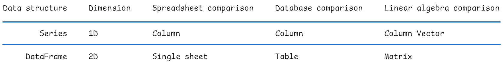

<!-- 
    Author : Kannan Jayachandran
    File : Readme.md (Pandas documentation)Not completed
 -->

<h1 align="center" style="color: orange"> Pandas </h1>

Pandas is a Python library designed to simplify working with relational or labeled data, making the process both easy and intuitive. One of the keys to understanding pandas is to understand the data model. At the core of pandas are two data structures. `Series` for array data and `DataFrame` for tabular data.



## Pandas Data Structures


### Series 

A one-dimensional array-like object that contains a sequence of values, similar to `NumPy` types, along with an associated array of data labels known as its `index`. The index in a Series can consist of any data type, including numbers, strings, or even dates.

### DataFrame

A two-dimensional data structure that can hold data of different types in rows and columns, similar to a spreadsheet or SQL table. A simpler version of how python would represent a column-oriented data structure similar to pandas dataFrame is like below:

```python
 df = {
   'index':[0,1,2],
    'cols': [
      { 'name':'growth',
      'data':[.5, .7, 1.2] },
      . . . .
      . . . .
```

### Axes in Pandas

In Pandas, data is organized along two axes:

**Axis 0 -> | Axis1 -> columns$**

The following image illustrates how data is organized along these axes in a DataFrame:


### Indexing and Slicing in Pandas

When working with Pandas, understanding how to use indices and slices is crucial. There are two types of indices:

- **Implicit (Positional) Indexing**: This is based on the integer location of the data. It is accessed using the `iloc` indexer. For example, `df.iloc[2]` refers to the third element in a series or the third row in a DataFrame.

- **Explicit (Label-Based) Indexing**: This involves using the index labels you assign to the Series or DataFrame, which can be numbers, strings, or other data types. The `loc` indexer is used for explicit indexing. For example, `df.loc[2]` refers to the element or row labeled with 2.

By default, Pandas uses explicit indices for accessing data (`df[2]`) and implicit indices for slicing (`df[2:5]`). Understanding these indexing methods becomes particularly important when dealing with duplicate indices.

---

- We use `None`, `NaN`, `nan`, `<NA>`, and `null` to represent missing data.

- Have values of similar type helps in faster computation(vectorization)

- **Category Datatype**: If we are dealing with categorical data, we can use the `category` data type in pandas. This can help in reducing memory usage and speeding up operations like `groupby`. Read about the [category](https://pandas.pydata.org/docs/user_guide/categorical.html#gotchas) data type in the pandas documentation.

- **Nullable Integer Datatype**: The nullable integer data type (`Int64`) allows for missing values in integer columns. Because `NaN` is a floating-point value, it forces an array of integers with any missing values to become floating point. In some cases, this may not matter much. But if your integer column is, say, an identifier, casting to float can be problematic. The nullable integer data type allows you to work with integer columns that have missing values without converting them to floating point. Read more about the [nullable integer data type]https://pandas.pydata.org/docs/user_guide/integer_na.html) in the pandas documentation.

---

Pandas is particularly strong in the following areas:

- **Handling Missing Data**: It provides robust methods to deal with missing values in your dataset.

- **Size Mutability**: You can easily insert or delete rows and columns.

- **Powerful Grouping (groupby)**: Pandas offers flexible group-by operations for aggregating data.

- **Versatile File Handling**: Pandas can seamlessly work with a variety of file formats, including flat files (CSV, TXT), Excel files, databases, HDFS formats, parquet files, and more.

- **Time Series Functionalities**: It has specialized functions for handling and manipulating time series data. In fact Pandas was originally developed for financial modeling.

### Common Pandas Functions

Below is a curated list of some of the most commonly used functions. But before that let's briefly discuss how these functions are distributed between Series and DataFrame objects. Some of the common types of functions in Pandas are:

- **Dunder methods**: (.__add__, .__iter__, etc) provide many numeric operations, looping, attribute access, and index access. For the numeric operations, these return Series.

- **Aggregate methods and properties**: Reduces or aggregate the values in a series down to  a single scalar value. The `.mean`, `.max`, and `.sum` methods and `.is_monotonic` property are all examples.

-  **Conversion methods**: Some of these start with .to_ and export the data to other formats.

- **Manipulation methods**: Such as `.sort_values`, `.drop_duplicates`, that return Series objects with
 the same index.

- **Indexing and accessor methods and attributes**: Such as `.loc` and `.iloc`. These return Series or
 scalars

- **String manipulation methods** using .str.

- **Date manipulation methods** using `.dt`.
- **Plotting methods** using `.plot`.

- **Categorical manipulation methods** using `.cat`.

- **Transformation methods** Such as `.unstack` and `.reset_index`, `.agg`, `.transform`.

- **Attributes** Such as `.index` and `.dtype`.

#### Creating a Series

```python
my_lis = [2, 5, 1, 3, 9, 5]
my_series = pd.Series(my_lis)

# More explicit way with string indices
my_series_exp = pd.Series(my_lis,
name='olympics_medals',
index=['US', 'Russia', 'India', 'China', 'Germany', 'Australia'])

my_series_exp.index
```

> If we check the index of `my_series_exp`, we can see the string indices along with its type (object; not a string).

```python
# Number of values in a series (Will not count NaN)
my_series_exp.count()

# Number of values including NaN
my_series_exp.size
```

#### Creating a DataFrame

```python
# Creating a DataFrame from a dictionary
data = {'Country': ['US', 'Russia', 'India', 'China', 'Germany', 'Australia'],
        'Medals': [2, 5, 1, 3, 9, 5],
        'Population': [323, 144, 1300, 1300, 83, 25]}
df = pd.DataFrame(data)

# Creating a DataFrame from a list of dictionaries
data = [{'Country': 'US', 'Medals': 2, 'Population': 323},
        {'Country': 'Russia', 'Medals': 5, 'Population': 144},
        {'Country': 'India', 'Medals': 1, 'Population': 1300},
        {'Country': 'China', 'Medals': 3, 'Population': 1300},
        {'Country': 'Germany', 'Medals': 9, 'Population': 83},
        {'Country': 'Australia', 'Medals': 5, 'Population': 25}]

df = pd.DataFrame(data)
```

#### Data Input/Output

- **`pd.read_csv(filepath_or_buffer)`**: Reads a comma-separated values (CSV) file into a DataFrame.
  - Additional file readers: 
    - **`pd.read_excel(filepath)`**: Reads an Excel file into a DataFrame.
    - **`pd.read_sql(query, con)`**: Reads a SQL query or database table into a DataFrame.
    - **`pd.read_json(path_or_buf)`**: Reads a JSON file into a DataFrame.

#### Data Inspection and Summary

- **`df.head(n=5)`**: Returns the first `n` rows of the DataFrame (default is 5).
  - **`df.tail(n=5)`**: Returns the last `n` rows of the DataFrame (default is 5).
- **`df.shape`**: Returns a tuple representing the dimensionality of the DataFrame (number of rows and columns).
- **`df.info()`**: Prints a concise summary of the DataFrame, including the index dtype, column dtypes, non-null values, and memory usage.
- **`df.describe()`**: Generates descriptive statistics of numeric columns, such as count, mean, std, min, and percentiles.
  - *Note*: While `df.describe()` is useful, it may not always provide a complete or accurate summary, especially for non-numeric data or when outliers are present.

#### Accessing DataFrame Components

- **`df.columns`**: Returns the column labels of the DataFrame. 
  - **`df.keys()`**: Works similarly, returning the column names.
- **`df.values`**: Returns a NumPy array representation of the DataFrame’s data.
- **`df.dtypes`**: Returns the data types of each column in the DataFrame.

#### Handling Missing Data

- **`df.isnull()`**: Returns a boolean DataFrame indicating if each value is NA (e.g., `None` or `numpy.NaN`), with True for missing values.
- **`df.drop(labels, axis=0/1)`**: Drops the specified labels from rows (`axis=0`) or columns (`axis=1`).
- **`df.dropna(axis=0/1, how='any/all')`**: Removes rows or columns with missing values. 
- **`df.fillna(value, method=None)`**: Fills NA/NaN values using the specified method or value.
- **`df.replace(to_replace, value)`**: Replaces values in the DataFrame that match `to_replace` with the specified `value`.

#### Data Manipulation and Transformation

- **`df.astype(dtype)`**: Casts a pandas object to a specified data type (`dtype`).
- **`df.rename(mapper, axis=0/1, inplace=False)`**: Renames the labels of the DataFrame's index or columns. 
  - Example: `df.rename({'old_name': 'new_name'}, axis=1, inplace=True)` changes a column name.
- **`df.sort_values(by, axis=0, ascending=True)`**: Sorts the DataFrame by the values along the specified axis.
- **`df.groupby(by)`**: Groups the DataFrame using a mapper or a series of columns, allowing for grouped operations like aggregation.
- **`df.concat(objs, axis=0/1)`**: Concatenates pandas objects along a particular axis with optional set logic along the other axes.

#### Working with Columns

- **`df[col_name].unique()`**: Returns the unique values in the specified column.
- **`df[col_name].value_counts()`**: Returns a Series containing counts of unique values in the specified column.
- **`df[col_name].nunique()`**: Returns the number of unique elements in the specified column.

### SQL-like Operations

One of the strengths of Pandas is its ability to perform SQL-like operations, making it a powerful tool for data manipulation and analysis. Functions like `groupby`, `merge`, `concat`, and `join` enable complex data operations that would typically require SQL.
