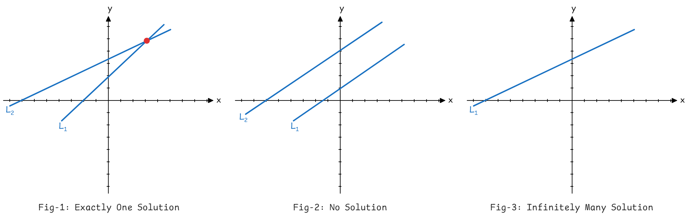
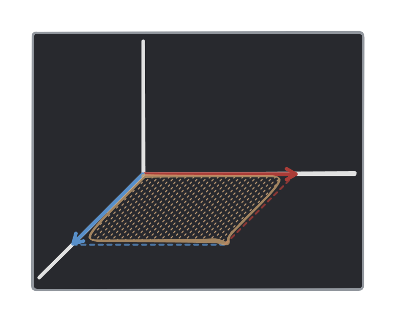
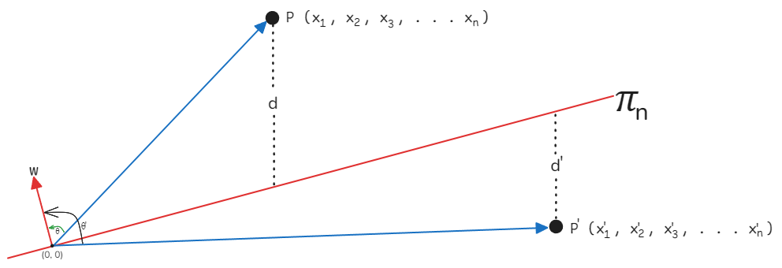

<!-- 
    Author : Kannan Jayachandran
    File : Linear_Algebra.md
    Section : Mathematics for data science and machine learning
 -->

<h1 align="center"> Linear Algebra </h1>

## Table of contents

1. [Linear Equations](#Linear-equations)
1. [Systems of linear equations](#Systems-of-linear-equations)

---

**Linear algebra is the branch of mathematics that deals with linear equations and their representations in vector spaces, through matrices.**

<!-- SECTION - I -->

## Linear equations

A **linear equation** is an equation that can be written in the form: 

$$a_1x_1 + a_2x_2 + ... + a_nx_n + b = 0$$

Where:

- $x_1, x_2, ..., x_n$ are the **variables** (Unknowns),

- $a_1, a_2,  ..., a_n$ are the **coefficients**,

- $b$ is a **constant** term.

> Example of a linear equation is $2x_1 + 3x_2 - 4 = 0$.

## Systems of linear equations

A **system of linear equations** is a set of linear equations that involve the same set of variables. In general, a system with $𝑛$ variables and $m$ equations can be written as:

$$a_{11}x_1 + a_{12}x_2 + a_{13}x_3 + ... + a_{1n}x_n = b_1$$

$$a_{21}x_1 + a_{22}x_2 + a_{23}x_3 + ... + a_{2n}x_n = b_2$$

$$a_{31}x_1 + a_{32}x_2 + a_{33}x_3 + ... + a_{3n}x_n = b_3$$

$$...$$

$$a_{m1}x_1 + a_{m2}x_2 + a_{m3}x_3 + ... + a_{mn}x_n = b_m$$

where:

- $x_1, x_2, x_3, ..., x_n$ are the variables,

- $a_{ij}$ are the coefficients of the variables,

- $b_i$ are the constant terms.

### Solutions of a System of Linear Equations

A system of linear equations can have:

1. **No solution** (the system is inconsistent and singular),

2. **Exactly one solution** (the system is non-singular, consistent and independent), or

3. **Infinitely many solutions** (the system is consistent and dependent).

To visualize this, let us plot two linear equations in two variables on a graph:

Thus, two fundamental questions about a system of linear equations are:

1. Is the system consistent? (i.e., does at least one solution exist?)

2. If the system is consistent, is the solution unique? (i.e., is there exactly one solution?)

### Methods to Solve a System of Linear Equations

There are several methods to solve a system of linear equations, such as:

- Substitution method

- Elimination method

- Matrix inversion

- Gaussian elimination

- Gauss-Jordan elimination

The above system of equations can be written in matrix form as:

$$Ax = b$$

Where:

- $A$ is an $m X n$ matrix of coefficients, which looks like:

$$A = \begin{bmatrix} a_{11} & a_{12}  & \cdots & a_{1n} \\ a_{21} & a_{22} & \cdots & a_{2n} \\ a_{31} & a_{32} & \cdots & a_{3n} \\ \vdots & \vdots & \ddots & \vdots \\ a_{m1} & a_{m2} & \cdots & a_{mn} \end{bmatrix}$$

- $x$ is the vector of variables,

$$x = \begin{bmatrix} x_1 \\ x_2 \\ \vdots \\ x_n \end{bmatrix}$$

- $b$ is the vector of constants.

$$b = \begin{bmatrix} b_1 \\ b_2 \\ \vdots \\ b_m \end{bmatrix}$$ 

<!-- SECTION - II -->

## Vector

A **vector** is a collection or list of numbers, often used to describe the state or properties of a system in mathematics, physics, and engineering. Vectors can represent anything from forces to velocities in different dimensions.

>Point or vector on cartesian coordinate system

An **n-dimensional** vector can be represented as $[x_1, x_2, x_3, ..., x_n]$

Where:

- $n$ is the length of the vector

- $x_i$ is a component of the vector in the **i-th** dimension.

> For example, a 3-dimensional vector could be written as: $[3, -4, 2]$

## Row and Column Vectors

Row vectors are vectors that consist of a single row and multiple columns. For example:

$$[1, 2, 3]$$

Column vectors are vectors that consist of a single column and multiple rows. For example:

$$\begin{bmatrix} 1 \\ 2 \\ 3 \end{bmatrix}$$

Taking the transpose of a row vector converts it into a column vector, and vice versa.

## Vector Dot Product

The **dot product** (also known as the scalar product) of two vectors is a scalar quantity, which is the sum of the products of their corresponding components. It is defined only for vectors of the same length.

The dot product of two vectors $a$ and $b$ is denoted by  $a \cdot b$, and is computed as:

$$a \cdot b = a_1b_1 + a_2b_2 + ... + a_nb_n$$

Alternatively, this can be expressed as the product of a row vector and a column vector:

$$[a_1, a_2, a_3, ..., a_n] \; \cdot \; \begin{bmatrix} b_1 \\ b_2 \\ b_3 \\ ... \\ b_n \end{bmatrix}$$

### Geometrically interpretation of dot product.

In an **n-dimensional space**, the dot product of two vectors $a$ and $b$ can be expressed as:

$$a.b = \sum_{i=1}^{n}a_ib_i = |a||b| \; cos\theta$$

where:

- $a = [a_1, a_2, a_3, ..., a_n]$ and $b = [b_1, b_2, b_3, ..., b_n]$

- $|a|$ and $|b|$ are the magnitudes(or lengths) of the vectors $a$ and $b$ ($|a| = \sqrt{a_1^2 + a_2^2 + a_3^2 + ... + a_n^2}$)

- $\theta$ is the angle between the two vectors.

> If the two vectors are perpendicular (i.e., $\theta = 90^{\circ}$), then $\cos \theta = 0$ and the dot product is zero. 

> If the two vectors are parallel (i.e., $\theta = 0^{\circ}$ or $180^\circ$), then the dot product is equal to the product of their magnitudes.

## Vector - Scalar Multiplication

A vector can be multiplied by a scalar, in effect scaling the magnitude of the vector. The scalar multiplication of a vector $a$ by a scalar $s$ is denoted by $s \cdot a$ and is given by:

$$s \cdot a = [s \cdot a_1, s \cdot a_2, s \cdot a_3, ..., s \cdot a_n]$$

where:

- $a = [a_1, a_2, a_3, ..., a_n]$ is the vector

## Inner product

The **inner product** is a generalization of the dot product that operates in any vector space, not just in Euclidean spaces. It is a function that takes in two vectors and returns a scalar, providing information about the "`correlation`" or "`similarity`" between the vectors. The inner product is typically denoted by:

$$\langle x, y \rangle$$

For two vectors $x$ and $y$, the inner product is defined as:

$$\langle x, y \rangle = x^Ty = \sum_{i=1}^{N}x_iy_i$$

where:

- $x = [x_1, x_2, x_3, ..., x_n]$,

- $y = [y_1, y_2, y_3, ..., y_n]$,

- $N$ is the number of dimensions (or length) of the vectors.

If the vectors are **correlated** or nearly parallel, the inner product will be large. f the vectors are close to **perpendicular**, the inner product will be small or zero.

> Inner product is used by Hilbert space (Hilbert spaces allow the methods of linear algebra and calculus to be generalized from Euclidean vector spaces to spaces that may be infinite-dimensional.)

>Geometric interpretation of inner product

The inner product $\langle x, y \rangle$ can be geometrically interpreted as the length of the projection of vector $y$ onto vector $x$ multiplied by the length of vector $x$.

## Vector norm

The **norm** of a vector is a measure of its length or magnitude. It quantifies the size or extent of the vector in its space. The norm of a vector $a$ is denoted by:

$$||a||$$

For an **n-dimensional** vector $a = [a_1, a_2, ..., a_n]$, the most commonly used norm (the Euclidean norm) is given by:

$$||a|| = \sqrt{a_1^2 + a_2^2 + a_3^2 + ... + a_n^2}$$

where $a = [a_1, a_2, a_3, ..., a_n]$ is a vector.

> Vector norm is always **non-negative**, and it describes the "length" or "distance" of the vector from the origin in the vector space.

### $L^1$ Norm

$L^1$ Norm or also called the **Manhattan** norm, is the sum of the absolute values of a vector’s components. It is denoted by $||a||_1$ and is defined as:

$$||a||_1 = |a_1| + |a_2| + |a_3| + ... + |a_n|$$

where:

- $a = [a_1, a_2, ..., a_n]$ is the vector.

> It is often used in machine learning as a regularization technique (known as **Lasso regression**) to keep model coefficients small and avoid overfitting.

### $L^2$ Norm

$L^2$ Norm also known as **Euclidean** norm, is the square root of the sum of the squares of the vector components. It is denoted by $||a||_2$ and is given by;

$$||a||_2 = \sqrt{a_1^2 + a_2^2 + a_3^2 + ... + a_n^2}$$

where $a = [a_1, a_2, a_3, ..., a_n]$ is a vector.

> It is used as a regularization technique in machine learning (known as **Ridge regression**) to prevent overfitting.

### $L^\infin$ Norm

**Vector max norm** or **maximum norm** or **supremum norm**  also called $L^\infin$ Norm is the largest absolute value of the components of the vector. It is denoted by $||a||_\infin$ and is given by;

$$||a||_\infin = max(|a_1|, |a_2|, |a_3|, ..., |a_n|)$$

> It useful in optimization problems where we are concerned with the maximum deviation of a vector’s components.

## Projection of a vector

The projection of a vector $a$ onto another vector $b$, denoted as $proj_b(a)$, is a vector $p$ that lies in the direction of $b$ and is collinear with $a$. This projection represents the component of $a$ that points along the direction of $b$.

Mathematically the projection of $a$ onto $b$ is given by: 

$$proj_b(a) = \frac{a \cdot b}{||b||^2}b$$

where:

- $a \cdot b$ is the dot product of vectors $a$ and $b$,

- $||b||^2$ is the square of the norm (or length) of vector $b$,

- $b$ is the vector in the direction of the projection.

We can write this also as:

$$d = \frac{a.b}{||b||} = d = ||a||cos\theta$$

where:

- $d$ is the scalar projection of $a$ onto $b$,

- $\theta$ is angle between the two vectors.

> If $a$ and $b$ are orthogonal (perpendicular), their dot product is zero, meaning the projection of $a$ onto $b$ is a zero vector.

## Unit vector

**Unit vector** is a vector with a magnitude (or norm) of 1. It is typically used to indicate direction without regard to magnitude. The unit vector of any vector $a$ is denoted by $\hat{a}$, points in the same direction as $a$, and is calculated as:

$$\hat{a} = \frac{a}{||a||}$$

where:

- $||a||$ is the magnitude of the original vector $a$.

- If the dot product of two vectors are zero, then they are orthogonal to each other. When two vectors are orthogonal and they are unit vectors, then they are called `orthonormal vectors`.

> Unit vector preserves the direction but normalizes the magnitude of the vector to a length of 1.

<!-- SECTION - III -->

## Matrix 

A matrix is a 2D array of numbers, organized into rows and columns. A matrix with $m$ rows and $n$ columns is said to have the dimension $m×n$.

## Types of matrices

- **Square matrix** : A matrix that has the same number of rows and columns. For example; 

$$X = \begin{bmatrix} 1 & 2 & 3 \\ 4 & 5 & 6 \\ 7 & 8 & 9 \end{bmatrix}$$

- **Diagonal matrix** : A square matrix where all elements outside the main diagonal are zero. For example: 

$$X = \begin{bmatrix} 1 & 0 & 0 \\ 0 & 5 & 0 \\ 0 & 0 & 9 \end{bmatrix}$$

- **Identity matrix** :A diagonal matrix where all the elements on the main diagonal are ones. For example:

$$X = \begin{bmatrix} 1 & 0 & 0 \\ 0 & 1 & 0 \\ 0 & 0 & 1 \end{bmatrix}$$

- **Upper triangular matrix** : A square matrix where all elements below the main diagonal are zero. For example:

$$X = \begin{bmatrix} 1 & 2 & 3 \\ 0 & 5 & 6 \\ 0 & 0 & 9 \end{bmatrix}$$

- **Symmetric matrix** : A square matrix that is equal to its transpose, (i.e. $X = X^T$) For example:

$$X = \begin{bmatrix} 1 & 2 & 3 \\ 2 & 5 & 6 \\ 3 & 6 & 9 \end{bmatrix}$$

- **Skew-symmetric matrix** : A square matrix that is equal to the negative of its transpose, (i.e. $X = -X^T$) For example: 

$$X = \begin{bmatrix} 0 & 2 & 3 \\ -2 & 0 & 6 \\ -3 & -6 & 0 \end{bmatrix}$$

- **Orthogonal matrix** : A square matrix whose rows and columns are orthonormal unit vectors. Mathematically, $Q^T \cdot Q = I$, where $I$ is the identity matrix. In other words a matrix is orthogonal if its transpose is equal to its inverse, i.e., $Q^T = Q^{-1}$. Orthogonal matrices preserves vector length and angle during transformations. For example:

$$Q = \begin{bmatrix} 1 & 0 & 0 \\ 0 & 1 & 0 \\ 0 & 0 & 1 \end{bmatrix}$$

- **Sparse matrix** : A matrix in which most of the elements are zero. Large sparse matrices are common, especially in applied machine learning, such as in natural language processing and recommendation systems. Working with sparse matrices as if they were dense can be computationally expensive due to memory and processing requirements. Significant performance improvements can be achieved by using specialized data structures and operations designed to efficiently handle sparse matrices.

Special data structures are often used to represent sparse matrices more efficiently, like:
 
- **Compressed Sparse Row** :  In this representation, the sparse matrix is stored using three one-dimensional arrays:

    - `Values` : An array of non-zero values in the matrix.

    - `Row offsets` : Indicates where each row starts and end in the `Values` array.

    - `Column indices` : Specifies the column position of each non-zero value in the matrix.

CSR is commonly used in machine learning because it allows efficient row slicing and matrix-vector multiplication.

$$X = \begin{bmatrix} 1 & 0 & 0 \\ 0 & 0 & 0 \\ 0 & 0 & 9 \end{bmatrix}$$

> A matrix with a high proportion of non-zero elements is referred to as a dense matrix. The **sparsity score** of a matrix is the ratio of the number of zero elements to the total number of elements in the matrix:

$$\text{Sparsity score} = \frac{\text{No. of zero elements}}{\text{Total no. of elements}}$$

## Matrix addition and subtraction

Two matrices with same dimensions can be added or subtracted together to create a new third matrix. The addition or subtraction of two matrices is done element-wise. For example:

$$X = \begin{bmatrix} 1 & 2 \\ 3 & 4 \end{bmatrix} \;\; Y = \begin{bmatrix} 5 & 6 \\ 7 & 8 \end{bmatrix}$$

$$X + Y = \begin{bmatrix} 1+5 & 2+6 \\ 3+7 & 4+8 \end{bmatrix} = \begin{bmatrix} 6 & 8 \\ 10 & 12 \end{bmatrix}$$

$$X - Y = \begin{bmatrix} 1-5 & 2-6 \\ 3-7 & 4-8 \end{bmatrix} = \begin{bmatrix} -4 & -4 \\ -4 & -4 \end{bmatrix}$$

## Matrix multiplication

Two matrices with same dimensions can be multiplied together, and this is often called element-wise matrix multiplication or the `Hadamard product`. It is not the typical operation meant when referring to matrix multiplication. It is denoted as $C = A \circ B$ and is given by:

$$C = \begin{bmatrix} a_{11} & a_{12} \\ a_{21} & a_{22} \end{bmatrix} \circ \begin{bmatrix} b_{11} & b_{12} \\ b_{21} & b_{22} \end{bmatrix} = \begin{bmatrix} a_{11}b_{11} & a_{12}b_{12} \\ a_{21}b_{21} & a_{22}b_{22} \end{bmatrix}$$

The **Matrix dot product** or **Matrix multiplication** is more complex than the Hadamard product and involves specific rules regarding dimensions. For two matrices to be multiplied, the number of `columns in the first matrix` ($m$) must equal the number of `rows in the second matrix` ($n$). It is denoted as $C = A \cdot B$ and is given by:

$$A = \begin{bmatrix} a_{11} & a_{12}  & a_{13} \\ a_{21} & a_{22} & a_{23} \\ a_{31} & a_{32} & a_{33} \end{bmatrix} \cdot B = \begin{bmatrix} b_{11} & b_{12} \\ b_{21} & b_{22} \\ b_{31} & b_{32}  \end{bmatrix} \rightarrow C = \begin{bmatrix} c_{11} & c_{12} \\ c_{21} & c_{22} \\ c_{31} & c_{32} \end{bmatrix}$$

Where:

- $A$ is an $m X n$ matrix,

- $B$ is an $p X q$ matrix,

- $C$ is an $m X q$ matrix

In order to obtain the values of the resulting matrix $C$, we multiply each element of the row of matrix $A$ by the corresponding element of the column of matrix $B$ and sum the results. For example:

$$c_{11} = a_{11}b_{11} + a_{12}b_{21} + a_{13}b_{31}$$

$$c_{12} = a_{11}b_{12} + a_{12}b_{22} + a_{13}b_{32}$$

$$c_{21} = a_{21}b_{11} + a_{22}b_{21} + a_{23}b_{31}$$

$$c_{22} = a_{21}b_{12} + a_{22}b_{22} + a_{23}b_{32}$$

$$c_{31} = a_{31}b_{11} + a_{32}b_{21} + a_{33}b_{31}$$

$$c_{32} = a_{31}b_{12} + a_{32}b_{22} + a_{33}b_{32}$$

## Transpose of a matrix

The **transpose** of a matrix is a new matrix formed by swapping the rows and columns of the original matrix. It is denoted by $X^T$ and is represented by:

$$X = \begin{bmatrix} a & b & c \\ d & e & f \end{bmatrix} \implies X^T = \begin{bmatrix} a & d \\ b & e \\ c & f \end{bmatrix}$$

> An invisible line can be drawn through the matrix from top left to bottom right on which the matrix can be flipped to give the transpose.

## Inverse of a matrix

The **inverse** of a matrix is a matrix that, when multiplied by the original matrix, results in the identity matrix. It is denoted by $X^{-1}$ and is given by:

$$ X^{-1} = \frac{1}{ad-bc}\begin{bmatrix} d & -b \\ -c & a \end{bmatrix}$$

Where:

- $X = \begin{bmatrix} a & b \\ c & d \end{bmatrix}$ is a $2 X 2$ matrix.

- A square matrix that is not invertible is called a **singular matrix**.

> **Whatever A does, $A^-1$ undoes**. :- _Introduction to Linear Algebra, Fifth Edition, 2016_)

> *$A^-1$ is primarily useful as a theoretical tool. In practice, we rarely compute the inverse of a matrix directly, as it is computationally expensive. Instead, we use matrix decomposition techniques like LU decomposition, QR decomposition, or Singular Value Decomposition (SVD) to solve systems of linear equations. :- **Deep Learning 2016*** 

## Trace of a matrix

The trace of a matrix is the sum of the elements on the main diagonal (top-left to bottom-right). It is denoted by $tr(X)$ and is calculated as:

$$tr(X) = a + d$$

Where:

- $X = \begin{bmatrix} a & b \\ c & d \end{bmatrix}$ is a $2 X 2$ matrix.

## Determinant of a matrix

The **determinant** of a matrix is a scalar value that represents how much the matrix scales the volume (or area) of the space it transforms (represented by the linear transformation). It is the product of the eigenvalues of the matrix (This property is crucial when we are dealing with larger matrices, with known eigenvalues). The determinant is denoted by $det(X) \;or \;|X|$ and for a $2X2$ matrix it is calculated as:

$$det(X) = ad-bc$$

Where:

- $X = \begin{bmatrix} a & b \\ c & d \end{bmatrix}$ is a $2 X 2$ matrix.

For a $3X3$ matrix, the determinant is calculated as:

$$det(X) = a(ei - fh) - b(di - fg) + c(dh - eg)$$

Where:

- $X = \begin{bmatrix} a & b & c \\ d & e & f \\ g & h & i \end{bmatrix}$ is a $3 X 3$ matrix.

>General formula

- If the determinant of a matrix is zero, it means that the matrix does not have an inverse.

### Intuition Behind the Determinant

The determinant is a scalar that tells us how much a matrix scales the volume (or area) spanned by its column vectors. In two dimensions, this is the area of the parallelogram formed by the column vectors (volume of the parallelepiped formed by the column vectors in 3D). 

- A determinant of 1 means the matrix preserves the volume or area without changing its size. 

- A determinant greater than 1 means the matrix expands the volume or area.

- A determinant between 0 and 1 indicates that the matrix shrinks the volume or area

- A negative determinant indicates the matrix reflects the space, flipping its orientation, in addition to scaling.

- If the determinant is zero, the matrix does not have an inverse. This happens because the rows or columns of the matrix are linearly dependent, meaning they lie along the same line or plane. In geometric terms, the matrix "squishes" (compress) the space into a lower dimension. For linear transformations, this implies that the transformation is not one-to-one, making the inverse either non-unique or nonexistent.

## Rank of a matrix

The rank of a matrix is the maximum number of linearly **independent** rows or columns in the matrix. It is denoted by $rank(X)$. The rank can be determined by transforming the matrix into its row echelon form or reduced row echelon form and counting the number of non-zero rows. Matrix decomposition techniques, such as Singular Value Decomposition (SVD), are also used to find the rank of a matrix.

### Intuition Behind the Rank of a Matrix

The rank of a matrix represents the number of dimensions spanned by its column vectors, or equivalently, the number of independent directions in the space.

- Rank 0: All the vectors span a single point, representing zero dimensions.

- Rank 1: The vectors span a line, representing one dimension.

- Rank 2: The vectors span a plane, representing two dimensions.

- Rank 3: The vectors span a volume, representing three dimensions.

## Matrix Decompositions

**Matrix decompositions** are methods that break down a matrix into constituent parts, making it easier to perform complex matrix operations with greater numerical stability on limited precision computers. These techniques do not compress the matrix; instead, they decompose it into its components. Matrix decompositions are also known as **matrix factorization techniques**. Two commonly used decompositions are:

### LU Decomposition

LU decomposition applies to square matrices, decomposing a matrix into a Lower triangular matrix $L$ and an Upper triangular matrix $U$. This decomposition can be written as:

$$A = L \cdot U \;or\; A = LU$$

Where:

- $A$ is the original square matrix,

- $L$ is the lower triangular matrix,

- $U$ is the upper triangular matrix.

LU decomposition is typically found through iterative numerical methods and may fail if the matrix cannot be decomposed directly. In practice, a variation called **LUP decomposition** (LU decomposition with partial pivoting) is often used to improve stability and robustness. In LUP decomposition, rows in the original matrix are reordered to make the decomposition feasible, and an additional $P$ matrix is included to capture this row reordering ($P$ matrix specifies a way to return to the original order). Unlike standard LU decomposition, LUP decomposition permits row exchanges. Thus we have:

$$A = L \cdot U \cdot P$$

Where:

- $P$ is the permutation matrix.

### QR Decomposition

The **QR decomposition** applies to $m X n$ matrices (not necessarily square) and decomposes a matrix into the product of an orthogonal matrix $Q$ of size $m X m$ and an upper triangular matrix $R$ of size $m X n$. It can be represented as:

$$A = Q \cdot R\; or \;A = QR$$

Where:

- $A$ is the original matrix,

- $Q$ is an orthogonal matrix (with $Q^T \cdot Q = I$),

- $R$ is an upper triangular matrix.

QR decomposition is typically computed through iterative numerical methods and may occasionally fail if the matrix cannot be decomposed directly. This decomposition is particularly useful for solving linear least squares problems and serves as the foundation for the QR algorithm in eigenvalue decomposition.

### Cholesky Decomposition

Cholesky decomposition applies to _symmetric positive definite matrices_ and decomposes a matrix into the product of a lower triangular matrix and its transpose. This can be represented as:

$$A = L \cdot L^T \;or\; A = U \cdot U^T$$

Where:

- $A$ is the original matrix,

- $L$ is the lower triangular matrix,

- $U$ is the upper triangular matrix (where $U = L^{T}$).

Cholesky decomposition is frequently used in machine learning for solving linear least squares problems (e.g., in linear regression) and in simulation and optimization tasks. For symmetric positive definite matrices, Cholesky decomposition is nearly twice as efficient as LU decomposition, making it a preferred choice when applicable.

### Eigendecomposition

**Eigendecomposition** is a technique for decomposing a square matrix into a set of `eigenvectors` and `eigenvalues`. A matrix can have one eigenvector and eigenvalue for each of its dimensions. We can express the original matrix as a product of its eigenvectors and eigenvalues:

$$A = Q \cdot \Lambda \cdot Q^{T}$$

Where:

- $Q$ is a matrix of the eigenvectors,

- $\Lambda$ is a diagonal matrix of the eigenvalues.

> Eigendecomposition has numerous applications, including principal component analysis (PCA) for dimensionality reduction, signal processing, and quantum mechanics.

### Eigenvectors and Eigenvalues

**Eigenvectors** are unit vectors (often represented as column vectors) that indicate the directions preserved by the linear transformation defined by the matrix. They are not rotated under the transformation—only scaled by their corresponding eigenvalues. A vector $v$ is called an eigenvector if it satisfies the following equation:

$$A \cdot v = \lambda \cdot v$$

Where:

- $A$ is the parent square matrix,

- $v$ is the eigenvector,

- $\lambda$ is the eigenvalue (a scalar).

This equation is known as the eigenvalue equation.

**Eigenvalues** ($λ$) represent how much an eigenvector is scaled during the transformation and satisfy the equation $A \cdot v = \lambda \cdot v$. 

Consider a matrix $A$ and a vector $x$, when we multiply $A$ by $x$, the resulting vector $Ax$ typically differs from $x$ in both magnitude and direction. However, certain special vectors, called eigenvectors, only change in magnitude when multiplied by $A$. The associated eigenvalue $\lambda$ indicates the extend fo this change:

- If $λ$ > $1$, the eigenvector is stretched.

- If $0$ < $λ$ < 1, the eigenvector is shrunk.

- If $λ$ = $1$, the eigenvector remains unchanged.

- If $λ$ < $0$, the eigenvector is reversed in direction and may also be stretched or shrunk.

Eigenvalues are often found first, and eigenvectors are then calculated by solving the equation $(A - λI)v = 0$, where $I$ is the identity matrix.

### Singular Value Decomposition (SVD)

Singular Value Decomposition (SVD) is a matrix factorization technique that decomposes a matrix $A$ into three matrices: $U$, $\Sigma$ and $V^T$. SVD is widely applied in machine learning and data science for tasks such as dimensionality reduction, data compression, and noise reduction. By leveraging SVD, a matrix can be represented in terms of its singular vectors and singular values, which are useful for analyzing its structure and properties. The SVD of a matrix $A$ is given by:

$$A = U \cdot \Sigma \cdot V^T$$

Where:

- $A$ is an $m X n$ matrix.

- $U$ is an $m X m$ orthogonal matrix, whose columns are left singular vectors of $A$.

- $\Sigma$ is an $m X n$ diagonal matrix, containing the singular values of $A$ arranged in descending order.

- $V^T$ is the transpose of an $n X n$ orthogonal matrix $V$, whose columns are right singular vectors of $A$.

> Each singular value in $Σ$ represents the extent to which its corresponding singular vector direction contributes to the overall data spread in $A$.

## Pseudoinverse

The pseudoinverse is a generalization of the matrix inverse that applies to both square and non-square (rectangular) matrices. The pseudoinverse of a matrix $A$ is denoted as $A^+$ and is particularly useful for solving systems of linear equations when an exact solution may not exist or when $A$ is not invertible. We can compute the pseudoinverse of $A$ using its SVD representation:

$$A^+ = V \cdot \Sigma^+ \cdot U^T$$

Where:

- $A$ is the matrix to be pseudoinverted,

- $V$ and $U$ are the matrices obtained from the SVD of $A$,

- $\Sigma^+$ is the pseudoinverse of the diagonal matrix $\Sigma$.

To compute $\Sigma^+$, we take the reciprocal of each non-zero element in $\Sigma$ and construct a new diagonal matrix with these reciprocals, then transpose it to fit the dimensions of $A^+$. Specifically:

$$\Sigma = \begin{bmatrix} \sigma_1 & 0 & 0 \\ 0 & \sigma_2 & 0 \\ 0 & 0 & \sigma_3 \end{bmatrix} \implies D^+ = \begin{bmatrix} \frac{1}{\sigma_1} & 0 & 0 \\ 0 & \frac{1}{\sigma_2} & 0 \\ 0 & 0 & \frac{1}{\sigma_3} \end{bmatrix}$$

> The pseudoinverse provides a way to find one of potentially many solutions to underdetermined or overdetermined linear systems.

## Tensors

A tensor is a generalization of vectors and matrices, and can be thought of as a multidimensional array. Tensors are classified based on their rank (_"rank" refers to the number of dimensions or indices needed to specify an element of the tensor_): a `scalar` is a tensor of `rank 0`, a `vector` is a tensor of `rank 1`, a `matrix` is a tensor of `rank 2`, and tensors with more than two dimensions are referred to as **n-dimensional tensors**, where $n$ represents the rank.

$$\large Scalar \rightarrow Vector \rightarrow Matrix \rightarrow Tensor$$

For a 3D tensor, axis 0 specifies the depth/height, axis 1 specifies the rows, and axis 2 specifies the columns.

$$X = \begin{bmatrix} \begin{bmatrix} 1 & 2 \\ 3 & 4 \end{bmatrix} & \begin{bmatrix} 5 & 6 \\ 7 & 8 \end{bmatrix} \\ \begin{bmatrix} 9 & 10 \\ 11 & 12 \end{bmatrix} & \begin{bmatrix} 13 & 14 \\ 15 & 16 \end{bmatrix} \end{bmatrix}$$

Where:

- $X$ is a 3D tensor with dimensions $2 X 4 X 2$.

> All arithmetic operations that can be performed on matrices can also be applied to tensors. This includes addition, subtraction, multiplication (both Hadamard product and dot product), and division. 

### Tensor dot product

The dot product of two tensors is a generalization of the dot product of vectors. It is denoted by $a ⊗ b$ and for vectors, it is computed as: 

$$a \cdot b = \sum_{i=1}^{n}a_ib_i$$

where $a$ and $b$ are two tensors.

<!-- SECTION - IV -->

---

## Line

A **line** is a one-dimensional figure that extends infinitely in both directions, having length but no width, depth, or curvature. Examples include a ray of light, the number line, etc. In two dimensions, a line is defined as the set of points $(x, y)$ that satisfy a linear equation:

$$w_{1}x_1 + w_2x_2 + w_0 = 0$$

Sometimes its also written as:

$$ax + by + c = 0$$

In three dimensions, instead of a line, we have a **plane**. A plane is the set of points $(x, y, z)$ that satisfy the equation:

$$ ax + by + cz + d = 0$$

In n-dimensional space, this generalizes to a hyperplane, which is the set of points $(x_1, x_2, \dots, x_n)$ that satisfy the equation:

$$a_1x_1 + a_2x_2 + a_3x_3 + ... + a_nx_n + b = 0$$

Which can also be written as:

$$w_{1}x_1 + w_2x_2 + w_3x_3 + ... + w_nx_n + w_0 = 0$$

This can be further simplified using vector notation as:

$$ w^Tx + w_0 = 0$$

> This is the equation of an hyperplane in an $n$ - dimensional space ($\pi_n$).

Here, $w = [w_1, w_2, \dots, w_n]$ and $x = [x_1, x_2, \dots, x_n]$ are column vectors. If the hyperplane passes through the origin, i.e., $w_0 = 0$, then the equation simplifies to:

$$w^Tx=0$$

> 0-Dimension : (A point) -> 1-Dimension : (A line) -> 2-Dimension : (A plane) -> n-dimension : (Hyperplane)

## Distance of a point from a plane

Consider a plane $\pi_n$ passing through the origin in an n-dimensional space, and a point $P$ located at coordinates $(x_1, x_2, \dots, x_n)$. The distance between the point and the plane is given by the formula:

$$d = \frac{w^Tp}{||w||}$$

where:
- $w$ is the normal vector to the plane $\pi_n$,

- $||w||$ is the magnitude of the vector $w$ (or Euclidean norm).

- $w^Tp$ is the dot product of the normal vector $w$ and the point vector $P$.

This formula gives the perpendicular distance from the point to the plane. Similarly, the distance from the plane to another point $P^{'}$ is calculated as:

$$d^{'} = \frac{w^Tp^{'}}{||w||}$$

In this context, the distance $d$ is positive if the angle between the normal vector $w$ and the point vector $P$ is less than $90^\circ$. Conversely, the distance $d^{'}$ is negative when the angle between the normal vector $w$ and the point vector $P^{'}$ is greater than $90^\circ$, indicating that the point $P^{'}$ lies on the opposite side of the plane.

> A positive distance implies that the point lies on the same side as the normal vector $w$, while a negative distance implies that the point is on the opposite side.

When computing the physical distance between a point and a plane, we generally take the absolute value of the signed distance to ensure it is non-negative, as negative physical distances are not meaningful. However, the sign of the distance is important for determining the relative position of the point with respect to the plane.

Some of the common **distance formulas** are;

| Description | Formula |
| --- | :--- |
| Distance between the origin $O(0, 0)$ and a point $P(x_1, x_2)$ in a 2D plane | $d = \sqrt{x_1^2+x_2^2}$ |
| Distance between the origin $O(0, 0, 0)$ and a point $P(x_1, x_2, x_3)$ in a 3D space | $d = \sqrt{x_1^2 + x_2^2 + x_3^2}$ |
| Distance between the origin $O(0, 0, 0, \dots, 0)$ and a point $P(x_1, x_2, x_3, \dots, x_n)$ in an n-dimensional space | $d = \sqrt{x_1^2 + x_2^2 + x_3^2 + \dots + x_n^2}$ |
| Distance between two points $P(x_1, y_1)$ and $Q(x_2, y_2)$ in a 2D plane | $d = \sqrt{(x_2 - x_1)^2 + (y_2 - y_1)^2}$ |
| Distance between two points $P(x_1, y_1, z_1)$ and $Q(x_2, y_2, z_2)$ in a 3D space | $d = \sqrt{(x_2 - x_1)^2 + (y_2 - y_1)^2 + (z_2 - z_1)^2}$ |
| Distance between two points $P(x_1, x_2, x_3, \dots, x_n)$ and $Q(y_1, y_2, y_3, \dots, y_n)$ in an n-dimensional space | $d = \sqrt{(x_1-y_1)^2+(x_2 - y_2)^2+(x_3 - y_3)^2+\dots+(x_n - y_n)^2} \\\ { or }\\ d = \sqrt{\sum_{i=1}^{n}(x_i - y_i)^2}$ |

> All these formulas represent the Euclidean distance, which measures the straight-line distance between two points in various dimensions. Each formula can be derived using the Pythagorean theorem.

## Slope

The slope of a line measures its steepness and is denoted by $m$. It is given by the formula:

$$m = \frac{y_2 - y_1}{x_2 - x_1}$$

where $(x_1, y_1)$ and $(x_2, y_2)$ are two distinct points on the line.

## Intercept

The intercept of a line is the point where the line crosses the y-axis. It is denoted by $c$ and can be found using the equation:

$$c = y - mx$$

where $(x, y)$ is a point on the line,s and $m$ is the slope.

## Circle

A circle is a set of points that satisfy the equation $x^2 + y^2 = r^2$, where $r$ is the radius, and the center is at the origin $(0, 0)$. The general form of a circle with center $(h, k)$ and radius $r$ is given by:

$$(x - h)^2 + (y - k)^2 = r^2$$

To determine whether a point $P(x_1, x_2)$ lies inside, on, or outside the circle, we use the following conditions:

- If $x_1^2 + x_2^2 < r^2$, the point lies inside the circle.

- If $x_1^2 + x_2^2 = r^2$, the point lies on the circle.

- If $x_1^2 + x_2^2 > r^2$, the point lies outside the circle.

In three dimensions, the equivalent of a circle is a **sphere**. The general equation for a sphere with center $(h, k, l)$ and radius $r$ is:

$$(x_1 - h)^2 + (x_2 - k)^2 + (x_3 - l)^2 = r^2$$

A **hypersphere** in n-dimensional space is defined by the equation:

$$(x_1 - h)^2 + (x_2 - k)^2 + (x_3 - l)^2 + ... + (x_n - m)^2 = r^2$$

If the center of the hypersphere is at the origin, the equation simplifies to:

$$x_1^2 + x_2^2 + x_3^2 + ... + x_n^2 = r^2 \\ or \\ \sum_{i=0}^{n}x_i^2 = r^2$$

The idea of determining whether a point lies inside, on, or outside a circle can be extended to higher dimensions. This concept is powerful, as it allows us to determine if a point lies inside a hypersphere in any dimensional space.

---

## Notations

| Notation | Description |
| --- | :--- |
| $a$ | Scalar or Vector |
| $A, B, C$ | Matrix |
| $A$ of size $\text{m X n}$ | Matrix `A` with `m` rows and `n` columns  |
| $A_{ij}$ | Element in the `i-th` row and `j-th` column of matrix `A` |
| $A^T$ | Transpose of matrix `A` |
| $v^T$ | Transpose of vector `v` |
| $A^{-1}$ | Inverse of matrix `A` |
| $A^*$ | Conjugate transpose of matrix `A` |
| $det(A)$ | Determinant of matrix `A` |
| $AB$ | Matrix multiplication of matrix `A` and matrix `B`|
| $u.v; \langle u, v\rangle$ | Dot product of `u` and `v`|
| $u \times v$ | Cross product of `u` and `v`|
| $\R$ | Set of real numbers (set $\R$ is infinite and continuous)|
| $\R^2$ | Two dimensional real vector space|
| $\R^n$ | n-dimensional real vector space |
| $v\in\R^n$ | Vector `v` belongs to the space $\R^n$|
| $\|v\|_1$ | L1 Norm or Manhattan distance of the vector $v$|
| $\|v\|_2; \|\|v\|\|$ | L2 Norm or Euclidean norm of the vector $v$|
| $\|v\|_\infin$ | Infinity Norm or Maximum Norm or Chebyshev Norm of vector $v$|
| $T: \R^n \rightarrow \R^m;T(v)=w$ | Transformation `T` of a vector `v` $\in \R^n$ into the vector `w` $\in \R^m$|

---

### [Jupyter notebook of linear algebra](./Notebooks/Linear_algebra.ipynb)

**Checkout [Calculus](./Calculus.md)**
