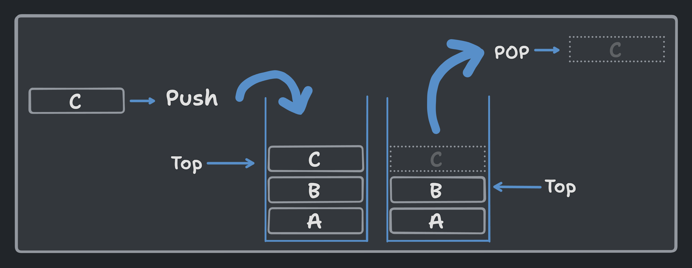

<h1 align="center"> Recursion & Backtracking </h1>

> ##  A function calling itself is called recursion.

Recursion is a problem-solving technique that involves dividing complex problems into smaller, solvable sub-problems. The solution to the original problem is obtained by combining the solutions of these sub-problems. In order to understand recursion, first we should know about the following terms:

### 1. Stack data structure and how function calls are stored in stack

A stack is a linear data structure with push and pop operations, following the _FILO_ (First In, Last Out) or _LIFO_ (Last In, First Out) order.



Each time a function is called, a new stack frame is created and pushed onto the stack. The stack frame contains the function's return address, parameters, and local variables. When the function returns, its stack frame is popped from the stack.

### Divide and Conquer

Divide and Conquer is a problem-solving technique that breaks down complex problems into smaller sub-problems. It involves solving these sub-problems and combining their solutions to obtain the solution to the original problem.


### Base case and Recursive case

A base case is a condition that stops the recursion. It represents the simplest computation that can't be broken down further. Think of it like the condition we write inside the loop to stop the loop. Recursive functions should have a base case to prevent infinite recursion.

A recursive case is a condition that calls the function recursively, moving towards the base case by modifying the function's parameters.

```python
def fib(n: int) -> int:
    # base case
    if n <= 1:
        return n
    else: 
        # recursive call
        return fib(n-1) + fib(n-2)
```

## Questions

1. Factorial of a number
2. Fibonacci series
3. Tower of Hanoi
