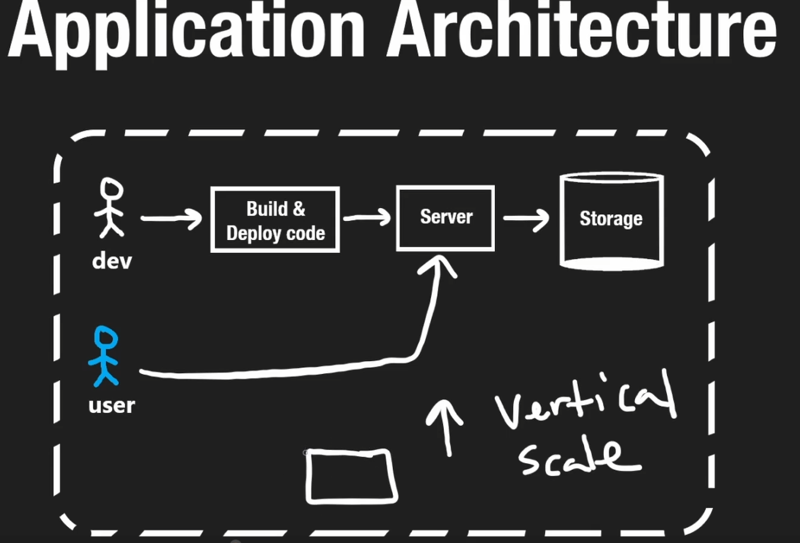

# sys designing : Neetcode.io

1. Computer Architecture
2. Application Architecture

3. CN (Computer Networks)
4. TCP IP and UDP
5. DNS (ISP, ISCANN, caching)
6. Application protocols
    1. Client-Server Model
    2. RPCs
    3. HTTP, Web sockets
