# GCP

> Image source: [Google Cloud Platform](https://cloud.google.com/)

Some of the key services of GCP are as follows:

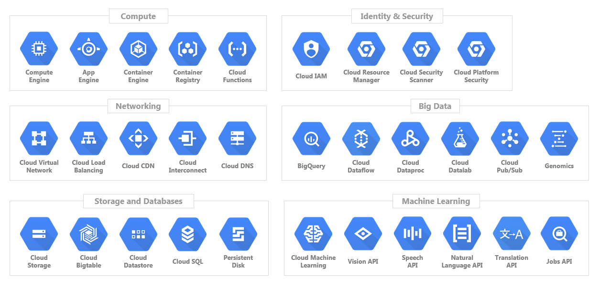

1. **Compute Engine**: It is a service that lets you create and run virtual machines on Google infrastructure, Similar to AWS EC2.

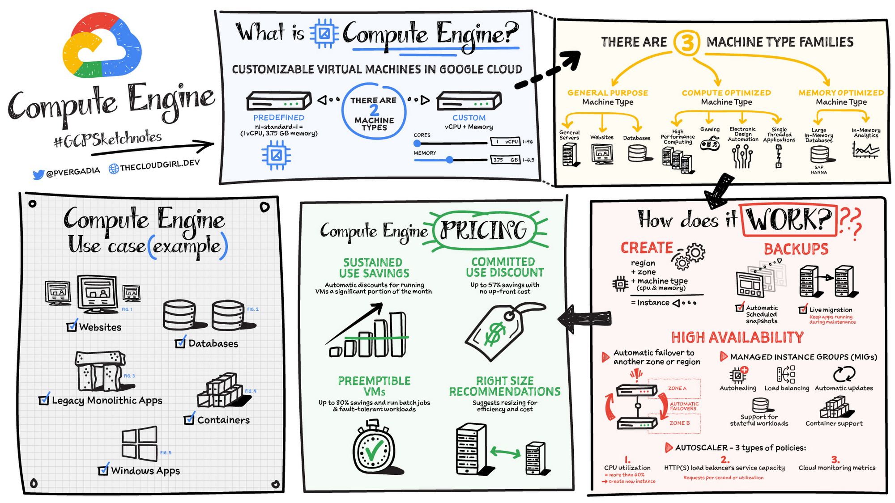

2. **App Engine**: App Engine is the fully managed serverless application platform, similar to AWS Lambda.

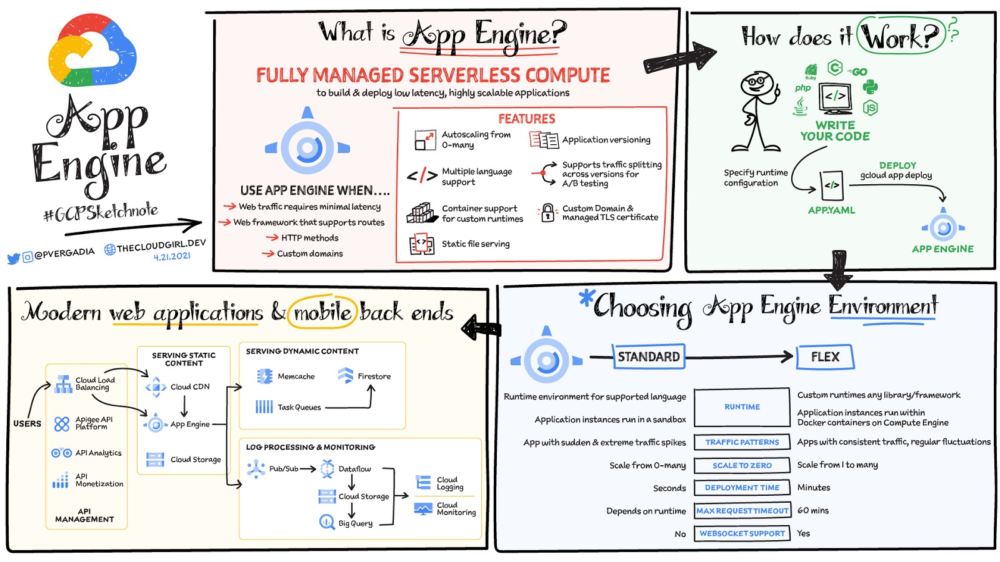

3. **Cloud Functions**: They are single-purpose functions that respond to some event and perform some specific action. While App Engine is better suited to applications, which have numerous pieces of functionality behaving in various inter-related (or even unrelated) ways. CF is similar to AWS Lambda. 

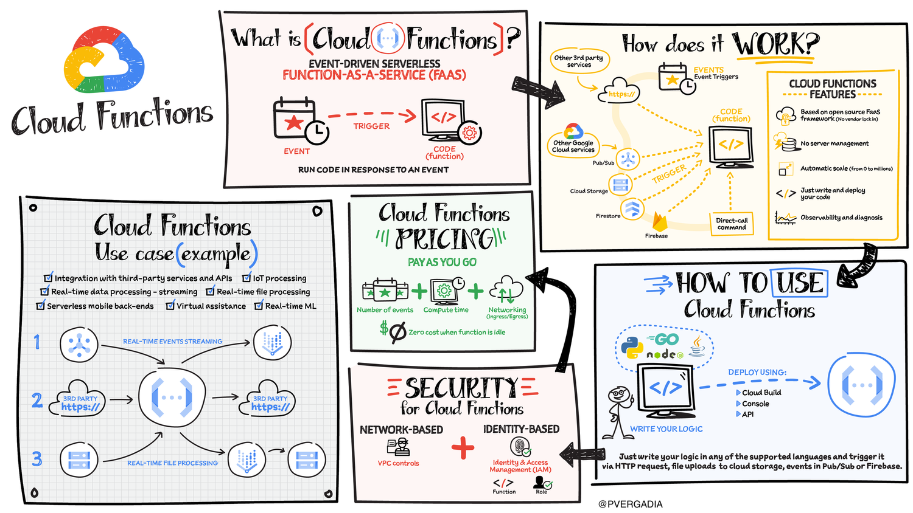

4. **Cloud Storage**: It is an object storage service that allows you to store and retrieve large amounts of data. Similar to AWS S3.

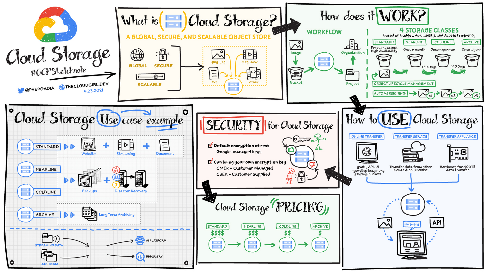

4. **Cloud Bigtable**: It is a fully managed wide-column NoSQL database service that is suitable for large analytical and operational workloads. Similar to AWS DynamoDB.

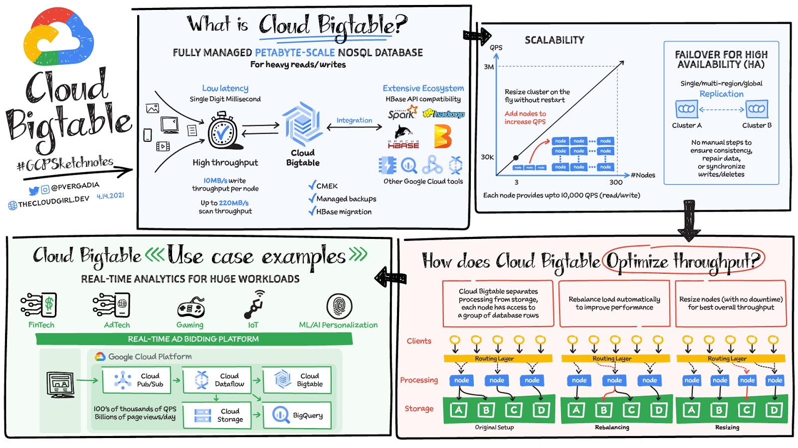

5. **Cloud SQL**: It is a fully managed relational database service that makes it easy to set up, maintain, manage, and administer your relational databases on Google Cloud Platform. Similar to AWS RDS.

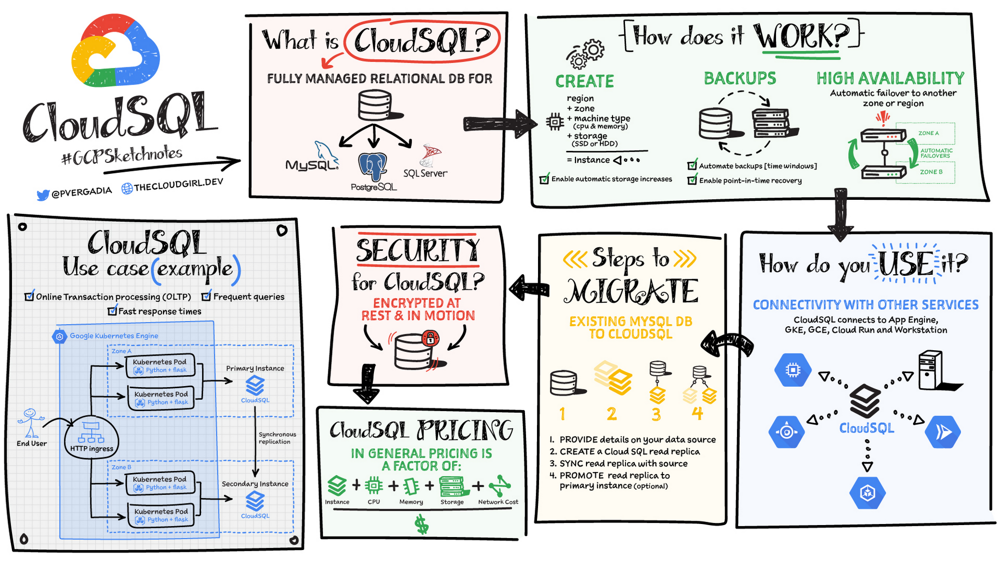

6. **Cloud Datastore**: It is a NoSQL document database built for automatic scaling, high performance, and ease of application development. `Firestore` is the next version of Cloud Datastore.
 Similar to AWS DynamoDB.

> When to use different storage options in GCP
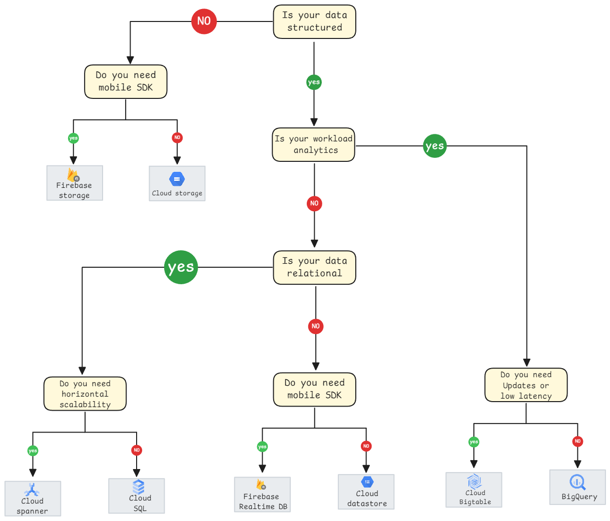

 |                  | Cloud Datastore    | Bigtable               | Cloud Storage | Cloud SQL             | Cloud Spanner         | BigQuery             |
|------------------|--------------------|------------------------|---------------|-----------------------|-----------------------|----------------------|
| **Type**         | NoSQL document     | NoSQL wide column      | Blobstore     | Relational SQL for OLTP | Relational SQL for OLTP | Relational SQL for OLAP |
| **Transactions** | Yes                | Single-row             | No            | Yes                   | Yes                   | No                   |
| **Complex queries** | No             | No                     | No            | Yes                   | Yes                   | Yes                  |
| **Capacity**     | Terabytes+         | Petabytes+             | Petabytes+    | Up to ~10 TB           | Petabytes             | Petabytes+           |
| **Unit size**    | 1 MB/entity        | ~10 MB/cell  ~100 MB/row | 5 TB/object | Determined by DB engine | 10,240 MiB/row        | 10 MB/row            |
| **Use case**     | Web and mobile apps | IoT, financial data    | Object storage | OLTP, e-commerce      | OLTP, e-commerce      | OLAP, data warehousing |

7. **Cloud Pub/Sub**: It is a messaging service that allows you to send and receive messages between independent applications. Similar to AWS SNS and SQS.

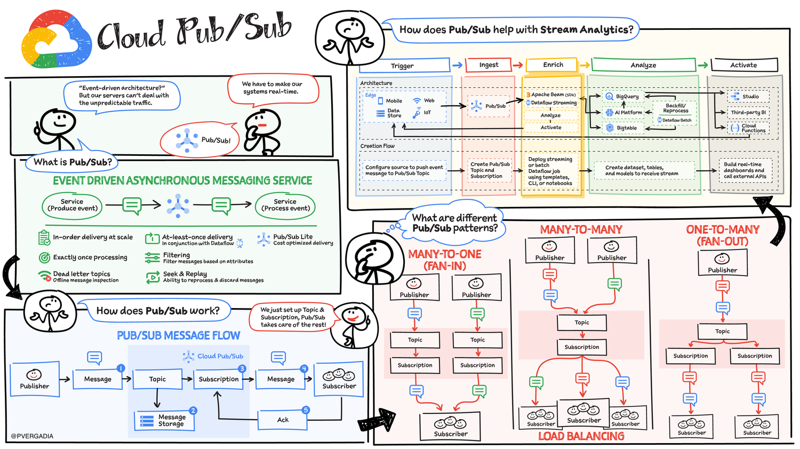

8. **Cloud Dataflow**: It is a fully managed service for stream and batch processing. Similar to AWS Kinesis Data Streams and AWS Kinesis Data Firehose.

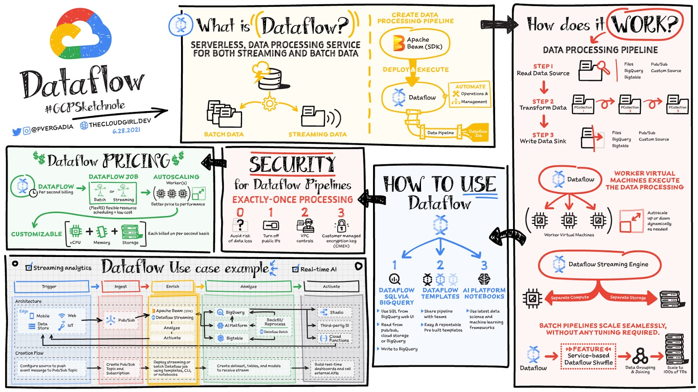

9. **Cloud Dataproc**: It is a fast, easy-to-use, fully managed cloud service for running Apache Spark and Apache Hadoop clusters. Similar to AWS EMR.

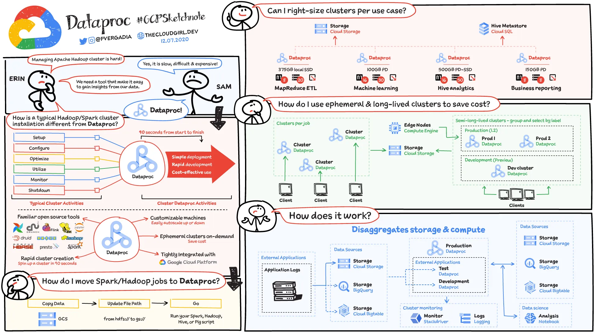