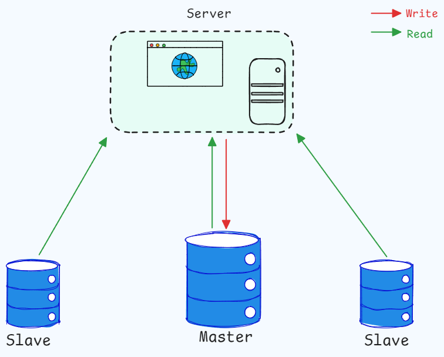
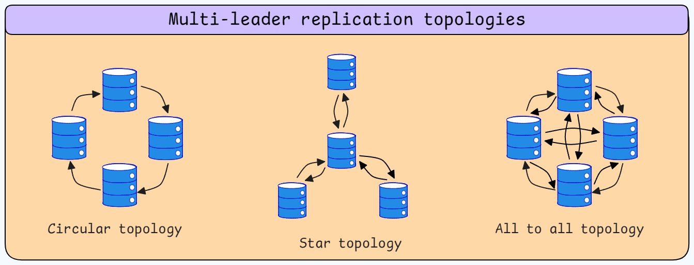

<h1 align="center">Distributed Systems</h1>

Here we will delve into the details of distributed systems, exploring how they function, how they are designed, and how they can be optimized. Our goal is to provide the knowledge necessary to select and optimize the best database for various use cases, as well as to understand the principles behind building scalable, reliable, and fault-tolerant distributed systems.

We start with databases; for most applications, the primary needs for a database are:

- **Fast reads**
- **Fast writes**
- **Data durability**

## Data Structures in Databases

A critical question in database design is: **Which data structure should we use to store the data?** The choice of data structure directly impacts the efficiency of read and write operations, as well as the overall performance of the database.

### Arrays and Linked Lists

- **Array:**
  - `O(n)` time complexity for reads and writes.

- **Append-only log:**
  - Appends new data and query data from the end.

- **Hash Map:**
  - `O(1)` time complexity for reads and writes. But does not scale well due to in-memory storage.

### Tree-Based Data Structures

Tree-based structures are the backbone of most modern databases. The most commonly used tree-based data structures are **B-Trees** and **LSM Trees**.

- **B-Trees:**
  - **Usage:** Predominantly used in relational databases such as MySQL and PostgreSQL.
  - **Pros:** They are balanced trees offering O(log n) read and write time and are optimized for disk reads and writes.
  - **Use Case:** Ideal for databases where read operations are more frequent than write operations.

- **LSM Trees (Log-Structured Merge-Trees):**
  - **Usage:** Widely used in NoSQL databases like Cassandra and HBase.
  - **Pros:** Optimized for write operations, with O(1) write time by writing data into an in-memory buffer.
  - **Use Case:** Best suited for scenarios where write operations are more frequent than read operations.

### Balancing Trade-Offs

Designing a database is not about selecting a single "best" data structure; it's about balancing trade-offs. The goal is to optimize read and write efficiency while maintaining data consistency and durability, without unnecessarily complicating the system.

### Indexing

Indexing in databases is the process of creating a data structure in order to maintain extra metadata on each write that allows for faster retrieval of data. Indexes are crucial for speeding up read operations. However, excessive indexing can slow down write operations, making it essential to strike a balance between the two.

### Data Structures Overview

The following table summarizes the most commonly used data structures in databases, along with their pros, cons, and typical use cases:

| Data Structure          | Pros                          | Cons                        | Use Case                                       |
|-------------------------|-------------------------------|-----------------------------|------------------------------------------------|
| **Hash Indexes**         | Fast read & write             | Slow on large datasets      | **Redis:** Suitable when all data is in memory |
| **SSTables and LSM Trees** | Fast write                   | Slow read                   | **Cassandra:** Ideal for high write throughput |
| **B-Trees**              | Efficient reads               | Slower writes               | **MySQL:** Better for read-heavy applications  |

---

## Data Replication

Data replication involves maintaining redundant copies of the database to ensure that the application remains operational even in the event of a crash. Replication also helps distribute the load across multiple database instances, enhancing performance and availability.

### Single Leader Replication

In a single leader replication architecture, one database instance (the leader) handles all write operations, while one or more follower databases replicate the leader's data. This architecture can increase system availability in several ways:

#### Adding a follower database

To add a follower database:

1. **Initialize**: Start by creating a snapshot of the leader database. This snapshot serves as the initial state of the follower database.

2. **Replication Log**: The follower database begins listening to the leader's replication log for any subsequent changes.

3. **Apply Changes**: The follower updates its state by applying these changes, keeping itself in sync with the leader.

#### Handling Follower Crashes

If a follower crashes, it tracks the last position in the replication log it processed. When it comes back online, it can request any changes from the leader that occurred after the last processed position, resuming synchronization from where it left off.

#### Handling Leader Crashes (Failover)

Failover or leader crash is more complex. During an event of failover:

1. **Consensus**: A new leader must be elected through a consensus mechanism.

2. **Reconfiguration**: Clients must be reconfigured to direct write requests to the new leader, and all other followers must start replicating from this new leader.

#### Challenges with Failover

- **Lost Writes**: During failover, some writes may be lost, leading to data loss or inconsistent replicas.

- **Accidental Failover**: Network issues or other disturbances might trigger unnecessary failover, causing system stress due to reconfigurations.

- **Split-Brain Problem**: If the old leader comes back online without realizing it’s no longer the leader, it might start accepting writes, causing a split-brain scenario where two leaders handle writes simultaneously.

#### Types of single leader replication

- **Synchronous Replication**:
  - The leader waits for the follower to acknowledge a write before acknowledging it to the client.
  - **Pros**: Ensures strong consistency as the follower always has the latest data.
  - **Cons**: Slows down write operations.  

- **Asynchronous Replication**:
  - The leader acknowledges a write to the client before the follower acknowledges it.
  - **Pros**: Speeds up write operations.
  - **Cons**: Can lead to eventual consistency issues if the follower fails.

#### Challenges with eventual consistency/Asynchronous Replication

Many modern applications rely on eventual consistency, which provides a good user experience but introduces challenges for developers:

- **Reading Your Own Writes:** 
  - A user may write a change and then immediately read from a replica that has not yet received the update.
  - **Solution**: Always read from the leader for operations where data consistency is critical.

- **Monotonic Reads**:
  - A user might read from one replica and see two out of three writes, then read from another replica and see only one write, making it appear as if data is reverting to an earlier state (going back in time).
  - **Solution**: Ensure the user reads from the same replica by hashing the user ID and mapping it to a specific replica.

- **Consistent Prefix Reads**:
  - If multiple users interact with the database, there can be cases where one user’s response is visible before the initial message, leading to confusion.
  - **Solution**: Use timestamps to order messages or ensure reads are consistent by accessing the same replica.
  > **Note**: Consistent prefix reads occur only when the reads are not ordered in time, which generally won't happen in the case of a single-leader replication system.

### Replication Log

A replication log records all changes made to a database, and a good replication log should meet two key criteria:

1. **Deterministic**: Ensures consistent outcomes for the same operations.
2. **Invariant to Environment Changes**: Remains functional even if the underlying database engine or environment changes.

- Avoiding SQL statements for replication logs is crucial because they can be non-deterministic (e.g., using functions like `CURRENT_TIME`). 

- Internal write-ahead logs (WALs) are not ideal for replication across different database engines. WALs are tightly coupled with the internal workings of a specific engine, such as the size of data blocks or storage locations, making them less extensible when transitioning to a new engine.

One effective way to implement a replication log is by using a _logical log_, which typically tracks changes at the row level, often using primary keys to describe modifications. This approach is future-proof, as it is less dependent on the specific database engine being used.

### Multi-Leader Replication

In a multi-leader replication setup, multiple database leaders across different locations (e.g., data centers) handle write operations. These leaders communicate with each other to synchronize data, allowing read operations to occur on any of the databases.

There are three primary multi-leader replication topologies:

- **Circular Topology**: Each leader forwards its writes to the next in a circle, which can cause failures if any leader goes down.

- **Star Topology**: One central leader communicates with all others, leading to single points of failure.

- **All-to-All Topology**: All leaders communicate directly with each other, reducing single points of failure but potentially leading to out-of-order writes due to network latency.

This setup is particularly useful in write-heavy applications, where a single leader could become a bottleneck. However, it requires dealing with conflicts that arise from simultaneous writes to different leaders.

### Conflict Resolution

When two leaders write to the same record, conflicts must be resolved. Here are some common strategies:

- **Conflict Avoidance**: Direct writes to the same item to a specific leader, avoiding conflicts but risking hotspots and configuration challenges.

- **Last Write Wins (LWW)**: Uses timestamps to determine the most recent write, but can lead to data loss. The choice between client and server timestamps and issues like clock skew must be carefully managed.

- **On-Read Resolution**: Stores conflicting writes and allows the user to resolve them during read operations, though this is not always feasible.

- **On-Write Resolution**: Uses custom functions or CRDTs (Conflict-Free Replicated Data Types) to merge conflicting writes automatically, which can be complex to implement.

### Detecting Concurrent Writes

Two writes are considered concurrent if they are not causally related, meaning one does not depend on the other. Detecting concurrency involves tracking what the client has seen from the database before making a write.

### Version Vectors

A version vector is a common method for detecting concurrent updates across multiple nodes. It consists of a list of pairs (node, counter), with one counter per cluster node.

#### Example of Version Vectors

Imagine a distributed system with three nodes: Blue, Green, and Black. Each node maintains its own counter, forming a version vector. Initially, the vector might look like this: `[Blue: 43, Green: 54, Black: 12]`.

- When the Green node updates its data, it increments its counter: `[Blue: 43, Green: 55, Black: 12]`.

- If Green and Black nodes exchange data, they synchronize their version vectors to detect any concurrent updates.

- If the Green node later tries to write to the database, it includes its current version vector. The database checks this vector against its own. If they match, the write proceeds. If not, the database detects a concurrent write and handles the conflict accordingly.

### Application Scenarios

- **Single-Leader Replication**: Best for read-heavy applications where consistency and simplicity are crucial.

- **Multi-Leader Replication**: Suitable for write-heavy applications requiring low latency and high availability, especially in geographically distributed setups.

