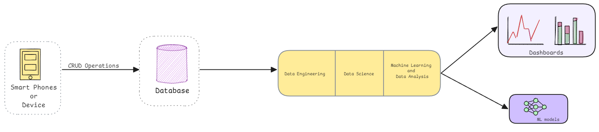
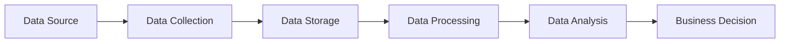
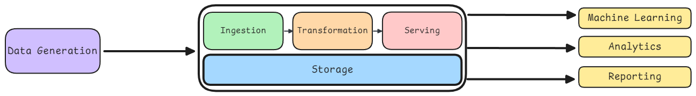
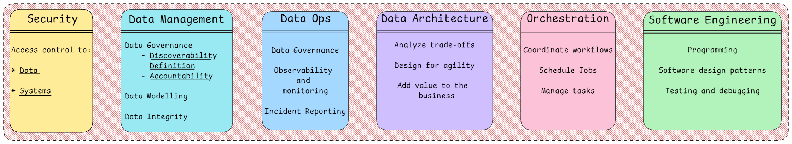

# Data Engineering

Data Engineering involves designing, building, and maintaining the infrastructure and systems that allow large amount of data to be collected, stored, processed, and analyzed efficiently. It involves creating pipelines that convert raw data into usable formats for analysis. The whole purpose of data engineering is to improve the business by reducing all sorts of data related overheads. 

## Data Flow

The basic flow of data in any business is as follows:

> **Roles** varies according to the company and the size of the company. In a small company, a data engineer might be responsible for all the tasks mentioned above. In a large company, the tasks might be divided among different roles.

The most important takeaway from the above diagram is that data engineering sits somewhere in between the database and data science/data analysis part.

## Data Engineering Lifecycle

The data engineering lifecycle involves the following steps:

- **Data Generation** : We need data to work with. This data can be generated from various sources like applications, sensors, IOT devices, Social Media, logs, etc.

- **Data Storage** : Once we have the data, we need to store it somewhere. Depending on the type of data, size of data and other requirements such as speed of access, read/write operations, we can choose the type of storage. It can be a SQL database (relational), NoSQL database, Data Warehouses (snowflake, redshift, BigQuery, etc.), Data Lake (also called object storage (S3, Azure Blob storage, Google Cloud storage, etc.)), etc.

We have two type of data storage processing;

| **Online Transaction Processing (OLTP)** | **Online Analytical Processing (OLAP)** |
|-------------------------------------|-------------------------------------|
| Used for transactional purposes. | Used for analytical purposes.     |
| Most probably Row based, hence used for fast read/write and insert operations on row level. | Mostly column based, hence used for fast read operations on column level for large data sets. |
| Used for real-time data processing. | Used for historical data processing. |
| Examples: MySQL, PostgreSQL, etc. | Examples: Snowflake, Redshift, BigQuery, etc. |

- **Data Processing** : Once we have the data stored, we need to process it. This involves cleaning the data, transforming the data, aggregating the data, etc. or called ETL (Extract, Transform, Load) operations.

- **Data Analysis** : Once we have the processed data, we can analyze it to generate insights. This is where data science comes into play.

## Other Key Concepts

### Security

Security is a very important aspect of data engineering. We need to ensure that the data is secure and is not accessible to unauthorized users. The data should be encrypted and stored in a secure location. Additionally we may need consider data backups and disaster recovery plans.

### Data Management

It contains the following aspects:

- **Data Governance** : Data governance is the process of managing the availability, usability, integrity, and security of the data in enterprise systems, based on internal data standards and policies that also control data usage. 

- **Data Modeling** : Data modeling is the process of creating a visual representation of the data and the relationships between different data points. It helps in understanding the data and the relationships between different data points.

- **Data Integrity** : Data integrity is the maintenance of, and the assurance of the accuracy and consistency of data over its entire life-cycle. It ensures that the data is accurate and consistent throughout.

### Data Ops

DataOps is a set of practices and tools that help organizations improve the speed and quality of their data analytics. It is similar to DevOps. 

It involves automating the data engineering processes, monitoring the data pipelines, and ensuring that the data is accurate and consistent.

**(Data governance, Observability, Monitoring and Incident reporting)**

### Data Architecture

Data architecture is the design of the data infrastructure that supports the data engineering processes. It consists of designing the data storage, data processing, data analysis components of the data infrastructure and designing the data pipelines that move the data from one component to another.

### Data Orchestration

Data orchestration is the process of automating the data engineering processes. It involves scheduling the data pipelines, monitoring the data pipelines, and ensuring that the data pipelines are running in order and timely.

### Software Engineering

Data engineering involves a lot of software engineering practices. It involves writing good quality code to process the data, writing code to automate the data engineering processes, writing code to monitor the data pipelines, etc.

## Data Architecture

Data architecture is the design of systems that support the evolving data need of an organization, achieved by flexible and reversible decisions reached through a careful evaluation of trade-offs. It encompasses data models, policies, standards, and the overall structure for data flow within an organization.

Data architecture has two main components:

- Business side or Operational architecture

- Technical architecture

### Business Side

Operational architecture ensures that the data practices aligns closely with your business needs. It should govern every piece of data you collect, store, and process. Some of the key insights are:

- **Start with the end in mind**: Understand the business goals and objectives and design the data architecture to support those goals.

- **Iterate and improve**: Data architecture is not a one-time thing. It should evolve as the business evolves.

- **Focus on impact**: Focus on the data that has the most impact on the business.

**For example the business needs of an e-commerce application would be;**

- Customer efficiency: Improve site navigation, personalized product recommendations, and customer service interactions.

- Operational Efficiency: Streamline inventory management, order processing, and shipping to reduce costs and delivery times.

- Marketing Insights: Analyze customer behavior to optimize marketing strategies, improve product placement, and increase sales.

- Vendor Management: Enhance data exchange with vendors for better product availability, pricing strategies, and quality control.

- Compliance and Security: Ensure customer data is secure and that the platform complies with relevant e-commerce regulations.

### Technical Architecture

Technical architecture talks about the actual tools and technologies we use to build these data infrastructure. There are innumerable tools and technologies available in the market. Some general ideas to choose the right tools is:

1. Keep the architecture simple while meeting the business needs; no need to over-engineer the solution or use the latest and greatest tools.

2. Choose the right tool for the right job; there is no one-size-fits-all solution.

3. Build for scale and flexibility; businesses pivot and change, so should the data architecture.

4. Embrace automation.

5. Prioritize data security and governance/compliance.

Some of the key components of the technical architecture are:

- Data sources

- Data Ingestion

- Data Storage

- Data Processing

- Data Analysis

- Data Visualization

- ML/AI Models

- Data Governance

### Data Sources

Data sources are the places where the data is generated. It can be from applications, sensors, logs, social media, etc. The data sources can be internal or external to the organization.

