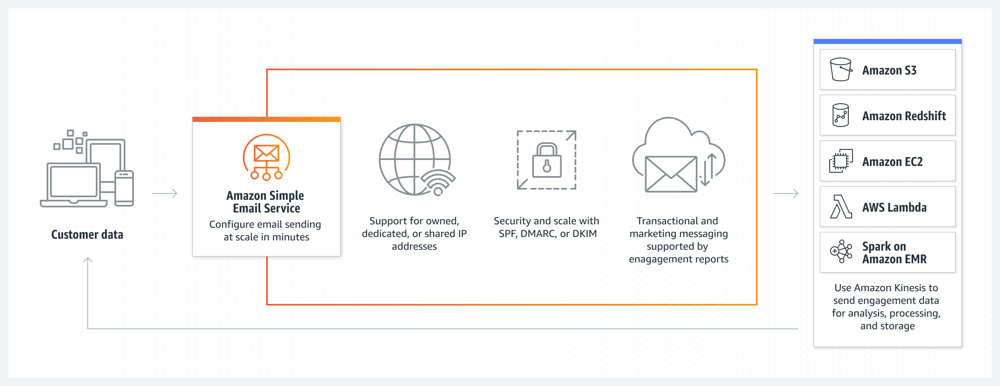
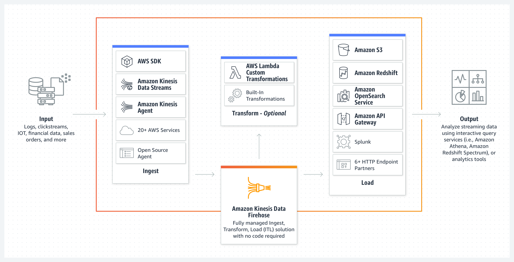

<h1 align="center"> Data Engineering </h1>

Data Engineering involves designing, building, and maintaining the infrastructure and systems that allow large amount of data to be collected, stored, processed, and analyzed efficiently. It involves creating pipelines that convert raw data into usable formats for analysis. The whole purpose of data engineering is to improve the business by reducing all sorts of data related overheads. 

## Data Flow

The basic flow of data in any business is as follows:

> **Roles** varies according to the company and the size of the company. In a small company, a data engineer might be responsible for all the tasks mentioned above. In a large company, the tasks might be divided among different roles.

The most important takeaway from the above diagram is that data engineering sits somewhere in between the database and data science/data analysis part. 

## Data Engineering Lifecycle

The data engineering lifecycle involves the following steps:

- **Data Generation** : We need data to work with. This data can be generated from various sources like applications, sensors, IOT devices, Social Media, logs, etc.

- **Data Storage** : Once we have the data, we need to store it somewhere. Depending on the type of data, size of data and other requirements such as speed of access, read/write operations, we can choose the type of storage. It can be a SQL database (relational), NoSQL database, Data Warehouses (snowflake, redshift, BigQuery, etc.), Data Lake (also called object storage (S3, Azure Blob storage, Google Cloud storage, etc.)), etc.

We have two type of data storage processing;

| **Online Transaction Processing (OLTP)** | **Online Analytical Processing (OLAP)** |
|-------------------------------------|-------------------------------------|
| Used for transactional purposes. | Used for analytical purposes.     |
| Most probably Row based, hence used for fast read/write and insert operations on row level. | Mostly column based, hence used for fast read operations on column level for large data sets. |
| Used for real-time data processing. | Used for historical data processing. |
| Examples: MySQL, PostgreSQL, etc. | Examples: Snowflake, Redshift, BigQuery, etc. |

- **Data Processing** : Once we have the data stored, we need to process it. This involves cleaning the data, transforming the data, aggregating the data, etc. or called ETL (Extract, Transform, Load) operations.

- **Data Analysis** : Once we have the processed data, we can analyze it to generate insights. This is where data science comes into play.

## Other Key Concepts

### Security

Security is a very important aspect of data engineering. We need to ensure that the data is secure and is not accessible to unauthorized users. The data should be encrypted and stored in a secure location. Additionally we may need consider data backups and disaster recovery plans.

### Data Management

It contains the following aspects:

- **Data Governance** : Data governance is the process of managing the availability, usability, integrity, and security of the data in enterprise systems, based on internal data standards and policies that also control data usage. 

- **Data Modeling** : Data modeling is the process of creating a visual representation of the data and the relationships between different data points. It helps in understanding the data and the relationships between different data points.

- **Data Integrity** : Data integrity is the maintenance of, and the assurance of the accuracy and consistency of data over its entire life-cycle. It ensures that the data is accurate and consistent throughout.

### Data Ops

DataOps is a set of practices and tools that help organizations improve the speed and quality of their data analytics. It is similar to DevOps. It involves automating the data engineering processes, monitoring the data pipelines, and ensuring that the data is accurate and consistent.**(Data governance, Observability, Monitoring and Incident reporting)**

### Data Architecture

Data architecture is the design of the data infrastructure that supports the data engineering processes. It consists of designing the data storage, data processing, data analysis components of the data infrastructure and designing the data pipelines that move the data from one component to another.

### Data Orchestration

Data orchestration is the process of automating the data engineering processes. It involves scheduling the data pipelines, monitoring the data pipelines, and ensuring that the data pipelines are running in order and timely.

### Software Engineering

Data engineering involves a lot of software engineering practices. It involves writing good quality code to process the data, writing code to automate the data engineering processes, writing code to monitor the data pipelines, etc.

## Data Architecture

Data architecture is the design of systems that support the evolving data need of an organization, achieved by flexible and reversible decisions reached through a careful evaluation of trade-offs. It encompasses data models, policies, standards, and the overall structure for data flow within an organization.

The following diagram shows an high-level overview of data architecture.

Data architecture has two main components:

- Business side or Operational architecture

- Technical architecture

### Business Side

Operational architecture ensures that the data practices aligns closely with your business needs. It should govern every piece of data you collect, store, and process. Some of the key considerations for business side are:

- **Start with the end in mind**: Understand the business goals  or objectives and design the data architecture to support those goals.

- **Iterate and improve**: Data architecture is not a one-time thing. It should evolve as the business evolves.

- **Focus on impact**: Focus on the data that has the most impact on the business.

### Technical Architecture

Technical architecture talks about the actual tools and technologies we use to build these data infrastructure. Selecting the right tools and technologies is very important. Some of the key considerations for technical architecture are:

1. Keep the architecture simple while meeting the business needs; no need to over-engineer the solution or use the latest and greatest tools.

2. Choose the right tool for the right job; there is no one-size-fits-all solution.

3. Build for scale and flexibility; businesses pivot and change, so should the data architecture.

4. Embrace automation.

5. Prioritize data security and governance/compliance.

Some of the key components of the technical architecture are:

A typical data architecture using services from AWS is shown below:

## Data Warehouse

Data Warehouse is a centralized repository of integrated data from various sources, optimized for analysis and reporting. It stores historical data in a structured format, supporting business intelligence and decision-making processes. We follow the `ETL` process to load data into the data warehouse.

Some organizations may prefer `ELT` process where data is loaded into the data warehouse first and then transformed. This may not be suitable always, as real world data is messy and almost always requires some level of cleaning and transformation before it can be loaded into the data warehouse.

### Dimensional Modeling

Dimensional modeling is a design technique for databases intended to support end-user queries in a data warehouse. It optimizes the database for fast queries and easy access to data. It is based on two types of tables:

- **Fact Tables**: These tables contain the quantitative data that can be aggregated. They are typically large and contain foreign keys to dimension tables.

- **Dimension Tables**: These tables contain the descriptive data that provides context to the fact data. They are typically smaller and contain textual data.

We can use `Star Schema` or `Snowflake Schema` for dimensional modeling. Where in star schema, the fact table is at the center and the dimension tables are connected to the fact table. It is called a star schema because it looks like a star. In snowflake schema, the dimension tables are normalized into multiple related tables, which reduces redundancy and improves data integrity.

### Slowly Changing Dimensions

Slowly changing dimensions are dimensions that change slowly over time. There are three types of slowly changing dimensions:

- **Type 1**: In this type, the old data is simply overwritten with the new data. This is the simplest method but it does not keep track of the history.

> EG: If the city of a customer changes, we simply update the city in the customer table. 

- **Type 2**: In this type, a new row is added to the dimension table whenever the data changes. This keeps track of the history but can lead to a large number of rows in the dimension table. We can either use a flag column or version column to keep track of the history and current value

> EG: If the city of a customer changes, we add a new row to the customer table with the new city and a new primary key.

- **Type 3**: In this type, a new column is added to the dimension table to store the new data. This keeps track of the history but can lead to a large number of columns in the dimension table.

There is also a `Type 6` or `SCD6`; which is a combination of type 1, type 2 and type 3. In this type along with the addition of new rows, we also update the latest value in all the rows.

> EG: If the city of a customer changes, we add a new column to the customer table to store the new city.

## Data Mart

Data Mart is a subset of a data warehouse that is designed for a specific business line or team. It contains a subset of data from the data warehouse and is optimized for a specific set of queries. It is used to provide data to a specific business line or team and is typically smaller than a data warehouse.

- The logic behind data mart is that not all data is relevant to all teams. So, instead of providing all the data to all the teams, we provide only the relevant data to the team. 

## Data Lake

Data Lake is a centralized repository that allows you to store all your structured and unstructured data at any scale. It stores data in its raw format and is optimized for storing large amounts of data. 

## Cloud Providers and their Services

There are many cloud providers that provide services for data engineering. There main cloud providers are:

- **Amazon Web Services (AWS)**

- **Google Cloud Platform (GCP)**

- **Microsoft Azure**

Along with them there are other cloud providers like IBM Cloud, Oracle Cloud, etc. Niche players like Snowflake, Databricks, etc. also provide services for data engineering.

Essentially every cloud provider, provides two things, Compute and Storage. Then they started providing managed services on top of these two. Like database, object storage, data warehouse, etc. Formally they are called as `Infrastructure as a Service (IaaS)`, `Platform as a Service (PaaS)`, `Software as a Service (SaaS)`.

| PaaS | SaaS | IaaS |
|------|------|------|
| Platform as a Service | Software as a Service | Infrastructure as a Service |
| Provides a platform for developing, running, and managing applications without the complexity of building and maintaining the infrastructure. | Provides software that is centrally hosted and managed for the end user. | Provides virtualized computing resources over the internet. |
| Examples: AWS Lambda, Google Cloud BigQuery, Azure SQL Database, etc. | Examples: Google Suite (Docs, Slide, Sheet) | Examples: AWS EC2, Google Cloud Compute Engine, Azure Virtual Machines, etc. |

### AWS

AWS provides a wide range of services for data engineering. Some of the key services are:

1. **S3 (Simple Storage Service)**: It is an object storage service that allows you to store and retrieve large amounts of data. It is highly scalable and durable.

2. **Lambda**: It is a serverless computing service that allows you to run code without provisioning or managing servers.

>Realtime file processing

>Realtime stream processing

3. **Elastic Container Service (ECS)**: It is a container orchestration service that allows you to run, stop, and manage Docker containers on a cluster.

4. **Simple Email Service (SES)**: It is an email service that allows you to send and receive emails.

5. **Aurora**: It is a relational database service that is compatible with MySQL and PostgreSQL.

6. **ElasticCache**: It is an in-memory caching service that helps improve the performance of web applications.

7. **Dynamo DB**: It is a NoSQL database service that provides fast and predictable performance with seamless scalability.

8. **Relational Database Service (Amazon RDS)**: It is a managed relational database service that makes it easy to set up, operate, and scale a relational database in the cloud.

9. **Amazon Kinesis Data Firehose**: It is a fully managed service for delivering real-time streaming data to destinations such as Amazon S3, Amazon Redshift, Amazon Elasticsearch Service, and Splunk.

10. **Kinesis Data Streams**: It is a scalable and durable real-time data streaming service that can continuously capture gigabytes of data per second from hundreds of thousands of sources.

11. **Kinesis Data Analytics**: It is the easiest way to process and analyze streaming data in real-time with SQL or Java without having to learn new programming languages or processing frameworks.

12. **Kinesis Video Streams**: It is a fully managed AWS service that you can use to stream live video from devices to the AWS Cloud, or build applications for real-time video processing or batch-oriented video analytics.

13. **EMR**: It is a big data platform for processing large amounts of data, interactive analytics, and machine learning using open-source frameworks such as Apache Spark, Apache Hive, Apache HBase, Apache Flink, Apache Hudi, and 
Presto. It was previously known as Amazon Elastic MapReduce.

14. **Amazon VPC**: It is a service that lets you launch AWS resources in a logically isolated virtual network that you define. VPC stands for Virtual Private Cloud.

15. **Redshift**: It is a fully managed, petabyte-scale data warehouse service in the cloud. You can start with just a few hundred gigabytes of data and scale to a petabyte or more.

16. **Amazon Simple Queue Service (SQS)**: It is a fully managed message queuing service that makes it easy to decouple and scale microservices, distributed systems, and serverless applications.

17. **Athena**: It is an interactive query service that makes it easy to analyze data in Amazon S3 using standard SQL.

18. **Glue**: It is a fully managed extract, transform, and load (ETL) service that makes it easy for customers to prepare and load their data for analytics.

19. **EC2**: It is a web service that provides secure, resizable compute capacity in the cloud. It is designed to make web-scale cloud computing easier for developers.

20. **Amazon Sagemaker**: It is a fully managed service that enables developers and data scientists to quickly and easily build, train, and deploy machine learning models at any scale.

21. **Elastic Load Balancing**: It automatically distributes incoming application traffic across multiple targets, such as Amazon EC2 instances, containers, IP addresses, and Lambda functions.

22. **Amazon Notification Service (SNS)**: It is a fully managed messaging service for both application-to-application and application-to-person communication.

**Example**

### GCP

GCP provides a wide range of services for data engineering.
