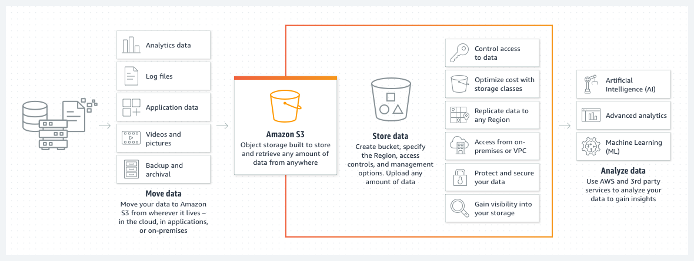
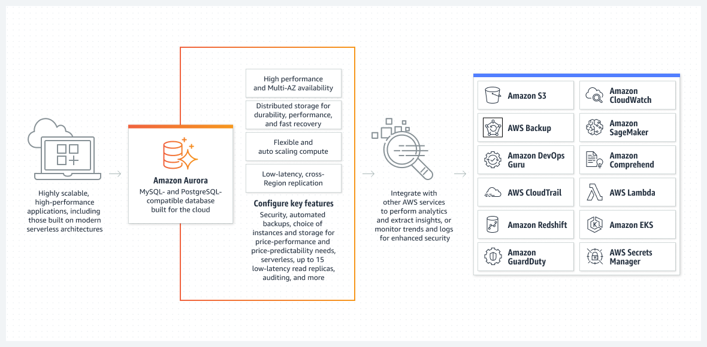
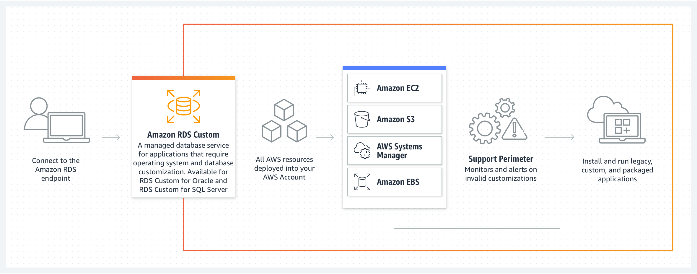
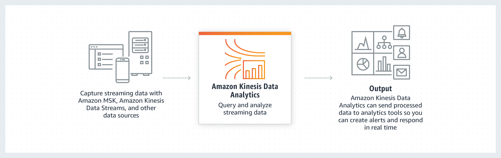
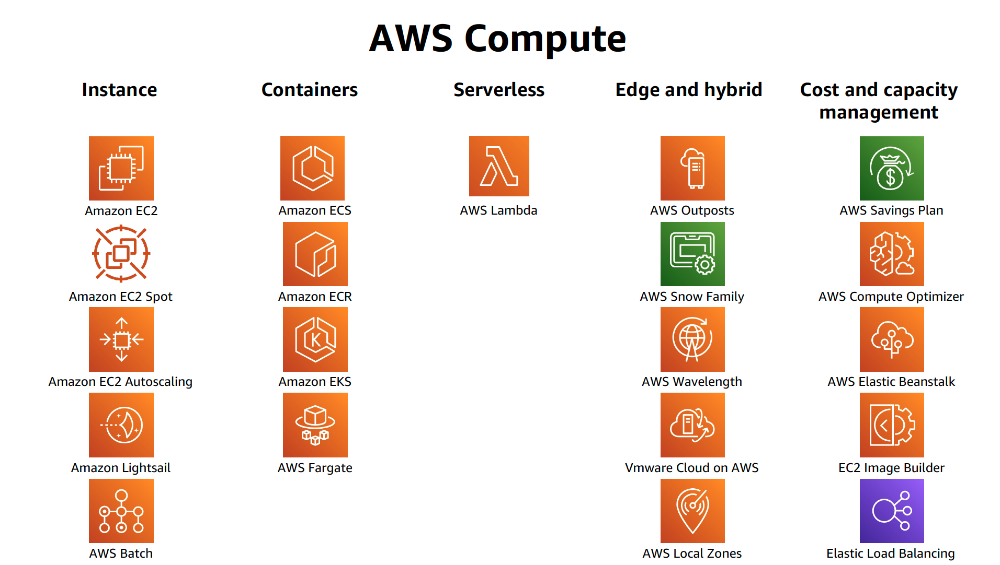

# AWS

> Image Source: [AWS](https://aws.amazon.com/)

Some of the key services of AWS are as follows:

1. **S3 (Simple Storage Service)**: It is an object storage service that allows you to store and retrieve large amounts of data. It is highly scalable and durable.

2. **Lambda**: It is a serverless computing service that allows you to run code without provisioning or managing servers.

>Realtime file processing

>Realtime stream processing

3. **Elastic Container Service (ECS)**: It is a container orchestration service that allows you to run, stop, and manage Docker containers on a cluster.

4. **Simple Email Service (SES)**: It is an email service that allows you to send and receive emails.

5. **Aurora**: It is a relational database service that is compatible with MySQL and PostgreSQL.

6. **ElasticCache**: It is an in-memory caching service that helps improve the performance of web applications.

7. **Dynamo DB**: It is a NoSQL database service that provides fast and predictable performance with seamless scalability.

8. **Relational Database Service (Amazon RDS)**: It is a managed relational database service that makes it easy to set up, operate, and scale a relational database in the cloud.

9. **Amazon Kinesis Data Firehose**: It is a fully managed service for delivering real-time streaming data to destinations such as Amazon S3, Amazon Redshift, Amazon Elasticsearch Service, and Splunk.

10. **Kinesis Data Streams**: It is a scalable and durable real-time data streaming service that can continuously capture gigabytes of data per second from hundreds of thousands of sources.

11. **Kinesis Data Analytics**: It is the easiest way to process and analyze streaming data in real-time with SQL or Java without having to learn new programming languages or processing frameworks.

12. **Kinesis Video Streams**: It is a fully managed AWS service that you can use to stream live video from devices to the AWS Cloud, or build applications for real-time video processing or batch-oriented video analytics.

13. **EMR**: It is a big data platform for processing large amounts of data, interactive analytics, and machine learning using open-source frameworks such as Apache Spark, Apache Hive, Apache HBase, Apache Flink, Apache Hudi, and 
Presto. It was previously known as Amazon Elastic MapReduce.

14. **Amazon VPC**: It is a service that lets you launch AWS resources in a logically isolated virtual network that you define. VPC stands for Virtual Private Cloud.

15. **Redshift**: It is a fully managed, petabyte-scale data warehouse service in the cloud. You can start with just a few hundred gigabytes of data and scale to a petabyte or more.

16. **Amazon Simple Queue Service (SQS)**: It is a fully managed message queuing service that makes it easy to decouple and scale microservices, distributed systems, and serverless applications.

17. **Athena**: It is an interactive query service that makes it easy to analyze data in Amazon S3 using standard SQL.

18. **Glue**: It is a fully managed extract, transform, and load (ETL) service that makes it easy for customers to prepare and load their data for analytics.

19. **EC2**: It is a web service that provides secure, resizable compute capacity in the cloud. It is designed to make web-scale cloud computing easier for developers.

20. **Amazon Sagemaker**: It is a fully managed service that enables developers and data scientists to quickly and easily build, train, and deploy machine learning models at any scale.

21. **Elastic Load Balancing**: It automatically distributes incoming application traffic across multiple targets, such as Amazon EC2 instances, containers, IP addresses, and Lambda functions.

22. **Amazon Notification Service (SNS)**: It is a fully managed messaging service for both application-to-application and application-to-person communication.

**Example**

